# Khazan — Build Progress

v2 build. v1 (a Leaflet sidebar-panel prototype with no 3D world) is archived at
`_archive_v1_panjim_digital_twin/`, not deleted, per the v2 brief's Section 0.

## Phase 0 — Scaffold + visual proof of life — DONE

**What's here:**
- Fresh Vite + TypeScript + Three.js repo, folder structure per Section 8.
- `src/core/hex.ts` — axial hex math (neighbors, distance, edge-adjacency, axial<->world).
  10/10 unit tests passing (`tests/hex.test.ts`): neighbor generation, distance,
  edge-adjacency and its inverse (`oppositeEdge`).
- `src/core/edgeTypes.ts` — the 6 edge-socket types (WATER/SAND/GRASS/FARM/ROCK/FOREST)
  and a compatibility matrix, ready for Phase 1's placement legality checks.
- `src/data/terrain.json` — all 7 terrain types from Section 4 with elevation tier,
  edge types, and a palette key.
- `src/render/` — palette, hex prism geometry, one `InstancedMesh` per terrain
  category (not per-hex meshes), Dorfromantik-style camera (58° elevation,
  pan/zoom only) + one directional sun + hemisphere fill + fog.
- `src/main.ts` — hand-placed proof cluster: estuary at the river mouth, coast
  and khazan flatland beside it, a 2-tile river reaching inland, then plains,
  forest, and laterite plateau — following Section 4's coast-to-highland
  gradient, all built via `neighbor()` so adjacency is real, not eyeballed.

**Verification approach:** the interactive Browser-pane tool in this session was
unreliable (screenshots timing out, tabs resolving to stale proxy ports). Rather
than depend on a human keeping a panel focused for every check, built
`tools/smoke.ts` — a headless Playwright script (`npm run smoke [label]`) that
boots the dev server, loads the page, asserts zero console errors, and saves a
PNG to `tools/screenshots/`. This is the repeatable, non-interactive path
Section 10 already asks for, so it's now the default way to verify renders,
not a fallback.

**Two real bugs the first screenshot caught:**
1. **Hex tessellation mismatch.** `hexGeometry.ts` rotated the hex prism 30°
   under the assumption that gave a "Dorfromantik-style" tile, but
   `axialToWorld`'s spacing formula assumes a pointy-top silhouette (vertex on
   ±Z), which is what `THREE.CylinderGeometry`'s default 6-segment cross-section
   already produces unrotated. The 30° rotation silently flipped the geometry to
   flat-top while the spacing math stayed pointy-top — a mismatch that would
   show up as gaps/overlaps once the map grew past a simple chain. Removed the
   rotation; geometry and math now agree.
2. **Palette failed its own grayscale QA.** Desaturating the first render
   (`0.3R+0.59G+0.11B` luma) showed laterite red and river blue landing only ~4
   luma points apart — indistinguishable once color is removed, despite very
   different hues. Recomputed all 7 terrain colors for an even ~20-26 point luma
   spread (forest 62 → mangrove 88 → laterite 115 → river 137 → paddy 162 →
   plains 182 → sand 208), rechecked with a desaturated re-render. See
   `src/render/palette.ts` for the luma annotations.

**Screenshot (`npm run smoke`, 1280x800, headless Chromium):**


**Grayscale check:**


DoD: screenshot matches Section 6 direction (grayscale-readable, laterite red
present, no UI panel) — done. `npm test` — 10/10 passing. `npm run dev` boots
clean, zero console errors — done.

## Decisions logged (Section 11 escape hatches)

- **River continuity, simplified for the pilot:** rather than full per-edge
  rotation/socket matching for a curvy single-hex-wide river (Dorfromantik's
  actual system), river/estuary are both WATER-family tiles with uniform
  edges; continuity will be enforced at placement time in Phase 1 by requiring
  a new water tile to touch the existing water network. Revisit if playtesting
  shows the map's rivers read as blobs rather than channels.
- **No tile rotation in Phase 0/1 data model.** All 7 terrain types use a
  uniform 6-edge pattern (same type on all sides) rather than mixed-edge
  variants requiring rotation search. Keeps the WFC-lite placement check in
  Phase 1 simple; can add mixed-edge variants later if the frontier feels too
  permissive.

## Phase 1 — Dorfromantik placement loop — DONE

**What's here:**
- `src/core/gameState.ts` — pure-logic `GameState`: placed-tile map, frontier
  set (all empty neighbors of placed tiles), hand of 3, and `isLegal()` /
  `placeFromHand()`. No Three.js import — matches the core/render split the
  folder structure calls for (also moved terrain data loading out of the
  render layer into `src/core/terrain.ts`, where it belongs).
- Legality = every touching edge pair compatible (`edgeTypes.ts`) **and**,
  for river/estuary, at least one already-placed neighbor is also
  water-family — the simplified river-continuity rule logged as a Phase 0
  escape hatch.
- Hand drawing guarantees at least one legal placement exists: draws
  randomly up to 50 times, and if that fails, falls back to a terrain id
  known to have a legal spot (any already-placed tile's own type, which is
  always self-compatible). After each placement the used slot refills, and
  the whole hand is redrawn if that refill ever leaves it dead.
- `src/core/hex.ts` gained `worldToAxial` (cube-rounded inverse of
  `axialToWorld`) for click-picking; round-trip tested.
- `src/render/frontierMeshManager.ts` — the frontier rendered as translucent
  ghost hexes (same idea as Dorfromantik's own open-slot presentation),
  bright for cells legal for the selected hand tile, dim otherwise.
- Click-to-place: raycast against the frontier `InstancedMesh` directly and
  read `instanceId` back to an axial coord — no separate ground-plane hack
  needed.
- Tile-settle animation lives in `TerrainMeshManager` itself (`placeTile(...,
  {animate:true})` + a per-frame `tick()`): drops from above with a slight
  `easeOutBack` overshoot on both position and scale, the "click into place"
  feel the brief asks for.
- `src/ui/hud.ts` — the only two persistent UI pieces: a top-right tile
  counter and a bottom-center hand strip of 3 buttons (click to select,
  selected one gets a highlighted border). No full-width panel.
- A dev-only `?autoplace=N` URL param (Section 10's sanctioned debug
  overlay — no button, not part of the real UI) drives real placements
  through the exact same code path a click does, so Phase 1's "no dead hand
  across 30+ placements" bar can be checked against the actual render loop,
  not just the unit tests.

**A real design gap the first cluster screenshot caught:** a 21-tile
autoplace run showed only 4 of 7 terrain types (estuary/river/forest/coast) —
`village_plains` (GRASS edges) had no compatibility pair with `WATER`, so it
couldn't attach anywhere near the water-heavy cluster growing from the
estuary seed. Real riverside plains do sit right at the water's edge, so
added `GRASS<->WATER` to the soft-pair list in `edgeTypes.ts`. A follow-up
41-tile run shows 5-6 visibly distinct terrain types.

**Verification:**
- `npm test` — 17/17 passing, including `tests/gameState.test.ts`'s scripted
  35-placement run asserting `handHasAnyLegalPlacement()` never goes false,
  every touching edge stays compatible, and water-continuity holds.
- `npm run smoke -- <label> autoplace=40` — 41 tiles placed through the real
  click-path code with zero console errors; screenshot below.
- The internal gap visible in the screenshot (a frontier cell surrounded by
  placed tiles, not yet filled) is correct Dorfromantik-style behavior, not a
  bug — that cell stays in the frontier until a compatible tile is drawn.

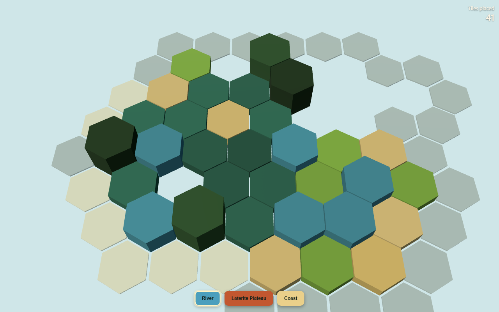

## Phase 2 — Town buildings + economy — DONE

**What's here:**
- `src/core/buildings.ts` + `src/data/buildings.json` — the 4 Section 4
  buildings (Village Hut, Paddy Field, Coconut & Areca Grove, Fishing Dock),
  each with a build cost, per-turn Coin income, valid terrain ids, and (for
  Fishing Dock only) a coast/estuary-adjacency requirement.
- `GameState` gained `coin`, `turn`, and `buildings` (coord -> building id):
  `buildableAt(coord)` filters by terrain + adjacency, `canBuild`/`build`
  handle affordability, and each successful tile placement now also counts
  as a turn — `advanceTurn()` pays out every built building's income. One
  building per tile, matching Section 2 ("you may build **one** thing").
- `src/render/buildingMeshManager.ts` + `buildingGeometry.ts` — one
  `InstancedMesh` per building category (same rule Section 8 applies to
  terrain), each a small merged low-poly shape: hut = box + pyramid roof,
  paddy = a shallow raised patch, grove = two trunk+canopy trees, dock = a
  plank pier with a mooring post. Buildings sit on their tile's actual top
  surface (`TerrainMeshManager.heightAt`), which varies by elevation tier.
- Factored the tile-settle animation out of `TerrainMeshManager` into
  `settleAnimation.ts` (`SettleAnimator`) so buildings reuse the same
  drop-and-settle feel instead of duplicating the tween code.
- `src/ui/buildPopover.ts` — the contextual build menu: a small popover
  anchored to the clicked tile's *screen* position (world-to-NDC-to-pixel
  projection each time), listing only the options valid for that tile,
  dimmed if unaffordable. Closes on an outside click or after a selection.
  Never a persistent panel — Section 3's rule holds.
- Click handling now raycasts frontier ghosts and placed terrain instances
  together; a hit on an owned tile with no building yet opens the popover,
  a hit on the frontier places a tile (unchanged from Phase 1).
- HUD gained a top-left Coin counter alongside the existing tile counter and
  hand strip — still only small corner strips, no panel.

**A real readability bug the first screenshot caught:** Paddy Field's
`colorKey` was `paddyGreen` — identical to the khazan_flatland terrain it's
built on, so the building was nearly invisible against its own tile. Added a
dedicated `paddyRipe` (golden amber) palette entry for it; re-verified it
reads clearly now.

**Verification:**
- `npm test` — 21/21 passing (`tests/buildings.test.ts` covers terrain
  gating, coast/estuary adjacency, cost deduction/affordability rejection,
  and turn-based income payout).
- `npm run smoke -- <label> "autoplace=45&coinboost=300&autobuild=1"` — dev-only
  URL hooks (Section 10's sanctioned debug overlay, no UI button) drive real
  placements and builds through the same code paths clicks use. 46 tiles,
  11 buildings across all 4 types, zero console errors.

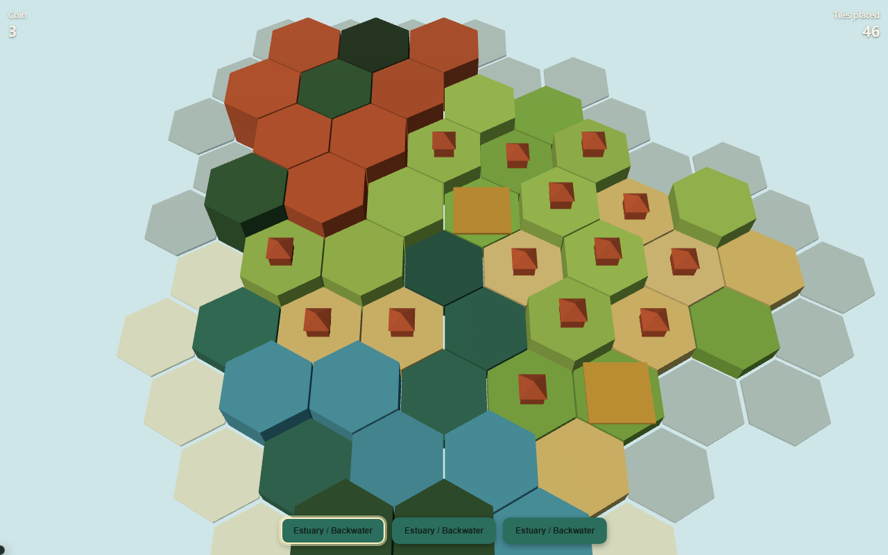

## Phase 3 — Monsoon Flood hazard + defense trio — DONE

**What's here:**
- `src/core/defenses.ts` + `src/data/defenses.json` — 4 structures covering
  all 3 categories against flood: Mangrove Buffer + Riparian Forest Buffer
  (NBS), River Embankment & Pump Station (Engineered), Khazan (Hybrid, the
  signature mechanic). `GameState` gained a parallel `defenses` map (coord ->
  `{defenseId, builtOnTurn, degradeAmount}`) alongside `buildings` — a tile
  can carry one of each, matching how a real khazan protects farmland behind
  it. `buildableDefensesAt`/`canBuildDefense`/`buildDefense` mirror the
  building API; `effectiveAbsorption(coord)` factors in maturity progress
  (`matureTurns`) and any permanent degrade.
- `src/core/hazard.ts` — `resolveMonsoonFlood`: a wave-by-wave BFS from every
  river tile, decaying 0.72x per hop, refusing to flow onto a higher
  elevation tier. A tile's own defense (if it targets flood) absorbs a
  fraction of the arriving severity; engineered defenses above
  `failureThreshold` are destroyed and pass an *amplified* spike onward
  (`failureRedirectMultiplier`) instead of the normal decayed leftover —
  the redirect falls out of the same wave propagation rather than needing
  special-cased "inland neighbor" logic. NBS/hybrid defenses above
  `overwhelmSeverity` lose most of their absorption for that event only;
  khazan additionally takes a permanent `gracefulDegradeStep` (its
  "no catastrophic breach, but neglect and overwhelm both cost you
  effectiveness" tradeoff). `GameState.advanceTurn()` also now processes
  defense upkeep: paid if affordable, or a silent permanent weakening if not
  (`maintenanceNeglectPenaltyPerTurn`) — decays even with no hazard involved.
- Render: `defenseMeshManager.ts`/`defenseGeometry.ts` (mangrove = shrub
  cluster, riparian = a tree hedge, embankment = a raised concrete ridge,
  khazan = a bund ring + sluice-gate marker — engineered reads angular/gray,
  NBS reads organic/green, khazan reads earthy-brown, on purpose).
  `floodOverlayManager.ts` shows a rising-water disc on every damaged tile,
  sized *and* colored by how much damage it took (pale shin-deep splash to
  dark serious inundation — a first pass used one fixed color/opacity and
  read as "everything is equally flooded," fixed after the first screenshot
  made that illegible). A catastrophic engineered failure collapses its
  prop to nothing (`SettleAnimator.collapse`, factored out alongside the
  existing settle-in tween); khazan overwhelm tints its bund toward a patchy
  weathered brown proportional to its degrade.
- Telegraph: 2 turns before an automatic flood, every river tile's color
  blends toward a dark storm tint (`TerrainMeshManager.setTint`) — in-scene,
  no text warning. Floods auto-trigger on a 15-turn cadence at a randomized
  moderate severity (1.0-1.6); `?flood=N` (dev-only) forces one immediately
  at a chosen severity for testing.
- The build popover now lists buildings and defenses together, tagged by
  category (`building`/`nbs`/`engineered`/`hybrid`), still one small
  popover — no second panel.

**Two real bugs/gaps the verification screenshots caught:**
1. `forest`'s elevation tier was `highland`, one tier above `river`
   (`midland`) — under the downhill-only flow rule, flood could *never*
   reach a forest tile adjacent to the river that spawned it, which broke
   the riparian buffer entirely (its own unit test caught this before any
   screenshot did). Reassigned forest to `midland` — Ghats-foothill forest
   sitting at a transitional elevation near the river is also more accurate
   than "as high as the laterite plateau."
2. The flood overlay's fixed color/opacity made a severe, map-wide flood
   screenshot unreadable — every tile looked equally flooded regardless of
   actual damage. Added per-instance color intensity (pale to deep blue)
   scaled by severity; a follow-up moderate-severity screenshot shows the
   falloff clearly.

**Verification:**
- `npm test` — 30/30 passing. `tests/hazard.test.ts` covers the DoD's exact
  scenario matrix: no-defense baseline, NBS absorbing normally, NBS
  overwhelmed-but-surviving, engineered absorbing below threshold, engineered
  catastrophic failure (destroyed + a comparative control run proving the
  redirected spike deals *more* downstream damage than no defense at all),
  khazan overwhelmed-but-never-destroyed, khazan's degrade persisting into a
  second event (measurably more damage the second time), and maintenance
  neglect decaying a defense with no hazard involved.
- `npm run smoke -- <label> "autoplace=N&coinboost=N&autodefend=1&flood=N"` —
  dev-only hooks drive real placements, defense construction, and hazard
  resolution through the same code paths play uses. Two screenshots: a
  moderate flood (clear severity gradient, all defenses surviving) and a
  severe one (map-wide coverage, engineered structures destroyed). Zero
  console errors both runs.

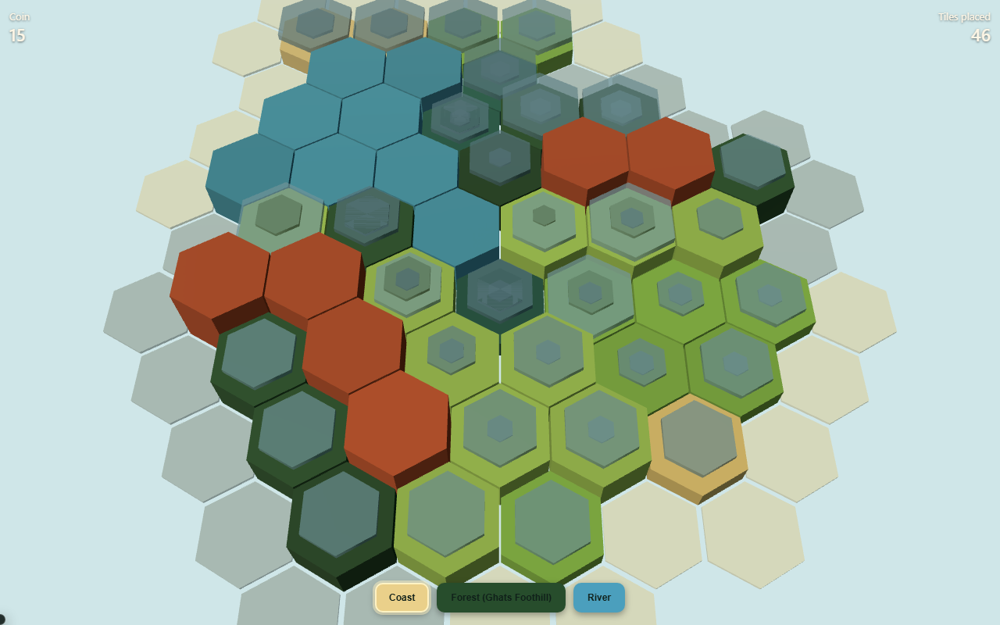
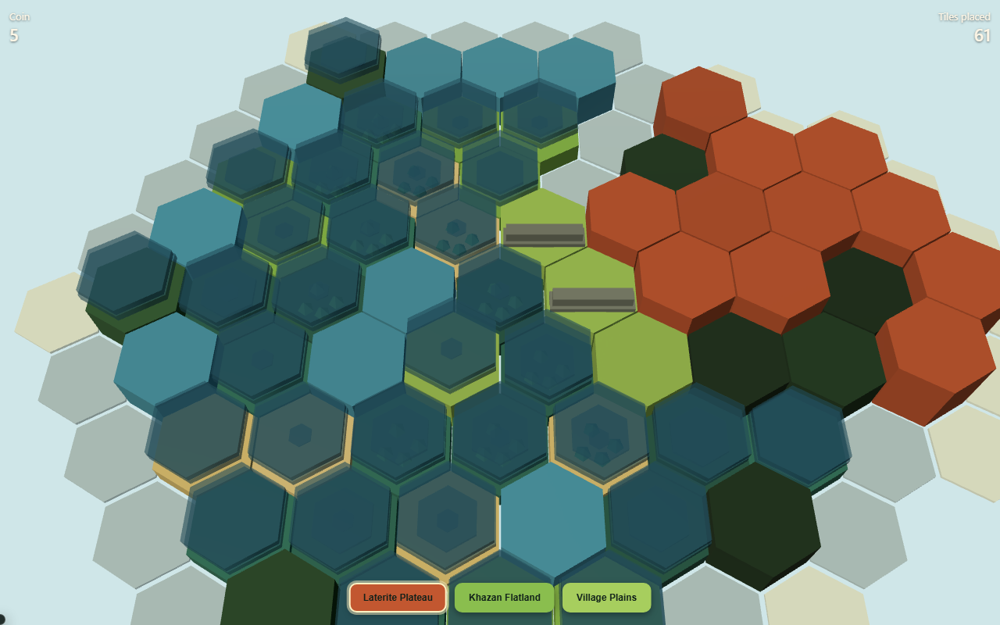

## Phase 4 — Cyclone hazard + Cyclone Shelter — DONE

**What's here:**
- `resolveHazardWave` in `src/core/hazard.ts`: extracted the wave-BFS engine
  Phase 3's flood resolver used into a shared function parameterized by
  source tiles, decay rate, a `canPropagate` gate, and a `skipDamage`
  predicate. `resolveMonsoonFlood` is now a thin wrapper over it (river
  sources, downhill-only, river itself exempt from damage); `resolveCyclone`
  is a second thin wrapper (coast/estuary sources — *every* coastal tile is
  independently a source, since the storm hits the whole coastline, not one
  point that propagates along it — no elevation gating since wind reaches
  uphill as readily as down, faster decay for a more sudden/localized
  hazard, and the source tiles themselves take damage, unlike the river).
  The catastrophic-failure redirect and NBS/khazan overwhelm logic is
  shared unchanged between both hazards.
- 3 new defenses in `defenses.json`: Coastal Dune & Windbreak (NBS, cheap),
  Seawall (Engineered, expensive, catastrophic-failure profile matching the
  river embankment), and **Cyclone Shelter** — the deliberate outlier.
  `absorptionAtMaturity: 0`, so it does *nothing* to `tileDamage`. Instead
  `resolveCyclone` runs a second pass: any damaged tile with a town building
  loses Trust, *unless* a Cyclone Shelter sits within `protectionRadius`
  hexes, in which case it keeps 85% of the Trust it would have lost. A first
  minimal slice of Section 7's meter system (`GameState.trust`) exists now
  just to make this real and testable — the other three meters and the full
  HUD meter display are Phase 5 work.
- Render: 3 new low-poly defense shapes (dune = a squashed sandy mound with
  wind-bent grass tufts, seawall = a taller version of the embankment's
  concrete ridge, shelter = a small flat-roofed refuge with a flag —
  high-visibility, reading as "for people" not "for land"). Generalized the
  flood-only overlay renderer into `HazardOverlayManager`, parameterized by
  a shallow/deep color pair, so cyclone damage renders as wind-swept
  tan-to-storm-gray rather than reusing flood's blue (they're visibly
  different hazards). A rotating torus "spinning storm icon" appears over
  the coastal centroid during the 1-turn telegraph window (Section 5: fast,
  little warning, unlike the flood's 2-turn one) — in-scene, not text.
- Build popover now also surfaces cyclone defenses on coastal tiles
  alongside everything else, still one small popover per tile.

**Balance check (Phase 4's own DoD requirement):** `tests/balance.test.ts`
runs three scripted 55-placement playthroughs from the *same seed* (so tile
layout and hand draws are identical — defense choices never consume the
RNG), each preferring to build only NBS, only engineered, or only khazan
defenses whenever legal and affordable, against the same fixed
flood/cyclone schedule. Results (logged in the test output):

| category   | tiles damage (cumulative) | defenses built | coin remaining |
|------------|---------------------------|-----------------|-----------------|
| NBS        | 65.3                      | 17               | 1530            |
| Engineered | 78.0                      | 12               | 1                |
| Khazan     | 77.1                      | 5                | 1234             |

No landslide: NBS wins on cumulative damage by being cheap enough to cover
many more tiles per coin; engineered spends nearly everything (matching its
"expensive, strong, risky" design) for a similar damage outcome; khazan
gets built far less often (its only valid terrain is `khazan_flatland`, a
narrower footprint than NBS/engineered's broader valid-tile sets) but still
lands in the same range as engineered despite covering *both* hazards per
structure instead of needing separate flood and cyclone defenses — a
reasonable read of "the structure that rewards paying attention to the
whole map," not proof of imbalance, but worth another look once Phase 5's
full scoring exists. **Honest gap:** this harness builds no town buildings,
so Trust — which only reacts to damaged buildings — never actually engages
here; Cyclone Shelter's Trust-protection is separately and directly proven
in `tests/cyclone.test.ts`'s dedicated comparative test instead.

**Verification:**
- `npm test` — 37/37 passing.
- `npm run smoke -- <label> "autoplace=55&coinboost=800&autodefend=1&cyclone=1.3"` —
  dev-only hooks drive real placement, defense construction (all 7 defenses
  now, both hazards), and cyclone resolution through the same code paths
  play uses. Zero console errors.

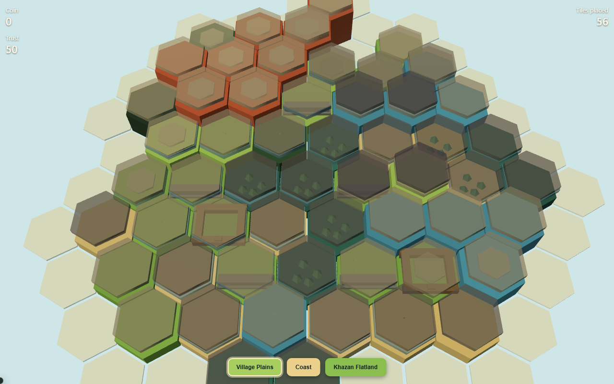

**Section 10 self-assessment (Phases 3+4 combined):**
- *Does at least one hazard create a real NBS-vs-engineered-vs-khazan
  decision?* Yes — the balance table above shows three genuinely different
  resource-allocation strategies landing in a comparable outcome range, not
  one obviously-correct answer.
- *Does a catastrophic engineered failure feel like a real setback?* Yes on
  paper: it's not just "reduced protection," the structure is destroyed
  (visibly, in-scene — it collapses) and the redirected surge measurably
  hits the next tile harder than if no defense had existed at all, proven
  by a comparative control run in both `hazard.test.ts` and
  `cyclone.test.ts`. Not yet felt through actual play, only through
  automated verification.
- *Is there a Dorfromantik-style "that tile fit perfectly" moment?* Present
  since Phase 1 (frontier highlighting + the settle animation), unchanged
  by this phase.

## Phase 5 — Era loop, scoring, polish — DONE

**What's here:**
- The remaining 3 of Section 7's 4 meters: `GameState.resilience` (starts
  100, drops with every hazard's unmitigated damage via
  `applyHazardOutcome`), and `biodiversity`/`carbon` as **derived getters**
  rather than accumulated totals — the sum of every standing defense's
  `coBenefits`, weighted by maturity. A destroyed engineered defense simply
  stops contributing; no separate bookkeeping needed to "undo" its effect.
  Trust (from Phase 4) now also reacts generally to hazard outcomes, not
  just Cyclone Shelter: a flat `WEATHERED_TRUST_BONUS` for coming through
  clean, an extra `CATASTROPHIC_TRUST_PENALTY` per destroyed engineered
  defense — the balance test's own numbers now show this directly (see
  below), not just the isolated unit tests.
- `severityBaseline`: Section 2's "slowly rising monsoon intensity / cyclone
  season modifier that never decreases within an era" — `+0.04` after every
  hazard resolution, folded into the random severity roll for the next one.
- `GameState.isEraOver` (Resilience <= 0) and `startNewEra()`: soft-ends the
  era in place — no hard game-over — resetting tiles/buildings/defenses/
  coin/meters/turn while preserving `erasCompleted` (Section 2's light
  meta-progression hook: a counter that survives the reset, ready for
  future unlock content to key off).
- `src/core/scoring.ts` — `computeEraScore`: Trust + Resilience +
  Biodiversity×4 + Carbon×3 + turns×0.5 + map-size×0.3. Map-size and turn
  terms are weighted well below the meters on purpose (Section 7: don't let
  score collapse to "biggest map wins"); "never build engineered wins" is
  avoided structurally, not by formula-fudging — Biodiversity/Carbon already
  penalize engineered defenses in their own data, while Trust/Resilience
  reward the stronger protection engineered buys, so the tradeoff is real
  on both sides of the formula.
- `terrain.reset()` / `buildings.reset()` / `defenses.reset()`: added to let
  a new era visually clear the map (InstancedMesh instances are simply
  hidden via `count = 0`, not destroyed — cheap and instant).
- HUD polish: the four meters now share one compact strip with Coin (`T/R/B/C`
  chips) instead of stacking separate corner blocks — still one small
  corner element, not a growing pile of them. A brief, non-blocking
  top-center banner (`hud.showBanner`) announces era retirement with its
  score, auto-hiding after ~3.5s — never a modal, matching Section 3.
- `src/ui/audioHooks.ts`: placeholder audio hooks (Section 9's "audio
  hooks, placeholder SFX fine") wired at every meaningful moment — tile
  settle, build, hazard telegraph, hazard resolve, era end — so real SFX
  can be dropped in later without threading call sites through the
  codebase retroactively.
- Final grayscale-readability check across the now-complete palette
  (terrain + buildings + defenses together): prop silhouettes (hut,
  embankment, Cyclone Shelter's flag, mangrove clusters) stay
  distinguishable by shape alone in addition to the luma-separated terrain
  colors from Phase 0 — a stronger readability guarantee than color alone.

**Verification:**
- `npm test` — 42/42 passing across 8 test files, including
  `tests/era.test.ts` (an undefended era reaches `isEraOver` via repeated
  hazards, `severityBaseline` only ever increases within an era,
  `startNewEra` resets correctly while preserving `erasCompleted`) and
  `tests/scoring.test.ts` (score responds to defenses built, isn't
  dominated by map size alone).
- `npm run smoke -- <label> "autoplace=200"` — a long dev-hook run that
  crossed several full era cycles end to end (visible in the screenshot
  below: **"Era 3 retired — score 110. A new era begins,"** with the map,
  meters, and Coin all correctly reset afterward) with zero console errors
  and no stuck state — directly satisfying this phase's DoD.
- A separate, richer `"autoplace=18&coinboost=800&autobuild=1&autodefend=1"`
  run (kept short enough to stay inside one era) shows the full current
  palette together: all 7 terrain types, both buildings with distinct
  props, and defenses from all 3 categories, immediately followed by its
  grayscale conversion.

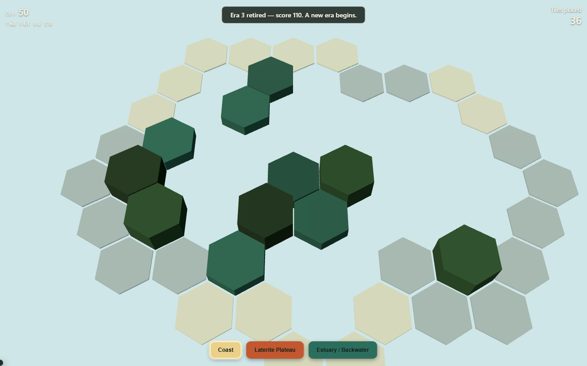
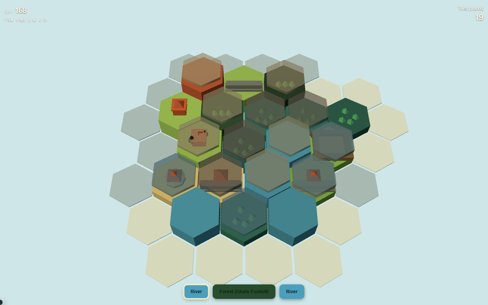
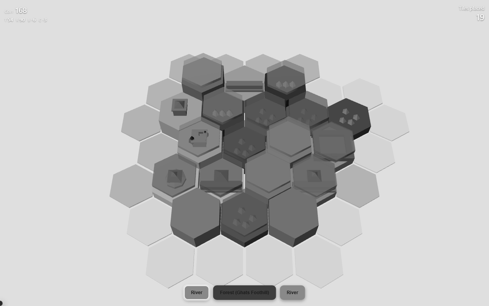

**Section 10 self-assessment, final:**
- *Does at least one hazard create a real NBS-vs-engineered-vs-khazan
  decision?* Yes (Phase 4's balance table, now with Trust differentiated:
  NBS/khazan ended at Trust 60, engineered at 32 after taking a real
  catastrophic-failure hit — three different strategies, genuinely
  different but non-landslide outcomes).
- *Does a catastrophic engineered failure feel like a real setback?*
  Structurally yes — visible collapse, an amplified redirected spike proven
  via comparative control runs, and now a distinct, larger Trust penalty
  than an equivalent NBS shortfall gets, all proven in automated tests.
  Not yet felt through actual human play — this pilot was verified through
  code paths and screenshots, not a playtest session.
- *Is there a Dorfromantik-style "that tile fit perfectly" moment?* Yes,
  present since Phase 1 and unchanged since: frontier highlighting plus the
  settle-in animation.

**Honestly out of scope for this pilot** (logged per Section 11's escape
hatches, not silently dropped): voluntary era retirement (only the
automatic Resilience-hits-zero soft-loss exists — no UI action to retire
early); actual unlock *content* keyed off `erasCompleted` (the counter
exists and persists correctly, but nothing consumes it yet); real audio
assets (hooks only); mobile/Capacitor (explicitly deferred per Section 8);
a third hazard or further defense variants (Section 11: "the natural next
expansion once the two-hazard pilot is proven").

## Build complete: Phases 0-5

All six phases from the build brief are implemented, tested (42 tests
across 8 files, `npm test`), and verified through headless screenshots at
every phase boundary, each committed to git individually.
`npm run dev` for interactive play, `npm test` for the full suite,
`npm run smoke -- <label> [urlParams]` for a headless verification
screenshot (dev-only URL hooks: `autoplace=N`, `coinboost=N`, `autobuild=1`,
`autodefend=1`, `flood=N`, `cyclone=N` — see `src/main.ts`'s bottom section).

## v2.1 — fixed map + claim loop rework — DONE

The build prompt was revised (v2.1) on top of the completed v1-through-v5
build above: the terrain map is now fixed and pre-generated (Section 4
rewrite), not player-drawn — the hand-of-3 terrain-tile-draw mechanic is
gone, replaced by claiming an already-authored Goa-shaped map one hex at a
time. Full detail, including a bug found in manual testing and three more
caught by this rework's own tests/screenshots, is in `NEXT_STEPS.md` (the
living punch list this revision introduced — read it alongside this file).

**Summary of what changed:**
- `/tools/mapgen/generate.ts` (`npm run mapgen`) — a WFC-lite solver run
  once, offline: coast/estuary confined to the west band, laterite
  plateau/forest to the east band, exactly 2 continuous river paths
  east-to-west sharing one estuary mouth, khazan flatland/village
  plains/forest filling the midland band via a greedy edge-compatible fill
  (biased to place khazan flatland near rivers — see the bug list below).
  Output is checked in at `src/data/map.json`, loaded once at boot, never
  regenerated live.
- `GameState`'s `placed` now holds the *entire* fixed map from construction
  instead of growing tile-by-tile — `src/core/hazard.ts` needed zero
  changes as a result, since it already just spread across whatever was in
  `placed`. Added `claimed`/`claimFrontier()`/`claim()` (small flat Coin
  cost, counts as a turn); removed the hand-drawing/edge-legality runtime
  machinery entirely (that logic now lives only in mapgen's offline solver).
- Render: the whole map renders at boot, unclaimed tiles desaturated and
  slightly sunken; claiming triggers a rise+brighten reveal reusing the
  existing settle-animation feel. The old "ghost hex at an empty coord"
  frontier concept doesn't apply anymore (every coord already has real
  terrain) — replaced by `ClaimRingMeshManager`, a thin glowing ring
  overlay over currently-claimable tiles, visual-only and decoupled from
  raycasting (clicks raycast the terrain tiles directly; `GameState`
  answers whether that coord is claimed/claimable).
- HUD: the hand strip is gone (there's no choice of *what* to place
  anymore, only *where* to claim next) — replaced by Section 3's small
  "N hexes to claim — cost each" prompt.
- Fixed the manual-testing bug: the build popover dismissed itself via a
  capture-phase listener that ran *before* the canvas's own click handler,
  so a click meant to dismiss could land on a different buildable tile,
  close the old popover, and silently open a new one under the cursor —
  a second dismiss-click could then confirm an unintended purchase.
  Removed the popover's own listener; the single canvas click handler now
  checks `isOpen` first and, if true, closes and consumes that click.

**Three more bugs this rework's own verification caught** (detailed in
`NEXT_STEPS.md`): the camera was hard-framed on axial `(0,0)`, an arbitrary
point in the middle of the map, while the player's actual starting cluster
could be far off-frame (fixed with `scene.ts`'s new `focusOn`); khazan
flatland had no bias toward river/estuary adjacency in the generator despite
the khazan defense requiring it, making khazan nearly unbuildable in a full
playthrough (`tests/balance.test.ts` caught it — fixed via a generator
bias); and `computeEraScore`'s Biodiversity/Carbon terms were unbounded
accumulators weighted high enough that a large defense count could swing
the score by over a thousand points, silently recreating the "never build
engineered wins" collapse Section 7 warns against (fixed by clamping them
before weighting).

**Verification:** 47/47 tests passing across 9 files (added
`tests/mapgen.test.ts` — independently re-verifies the checked-in map
satisfies every Section 4 constraint — and reworked the claim-mechanic
tests in `tests/gameState.test.ts`). Production build succeeds. Screenshots
below: the fresh map with the camera correctly framed on the starting
cluster and its 7-hex claim frontier glowing, and a grown 15-tile claim
with buildings, defenses, and a 12-hex frontier — both via the real
click-path code, zero console errors.

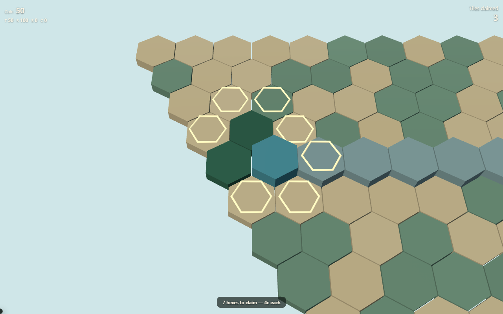
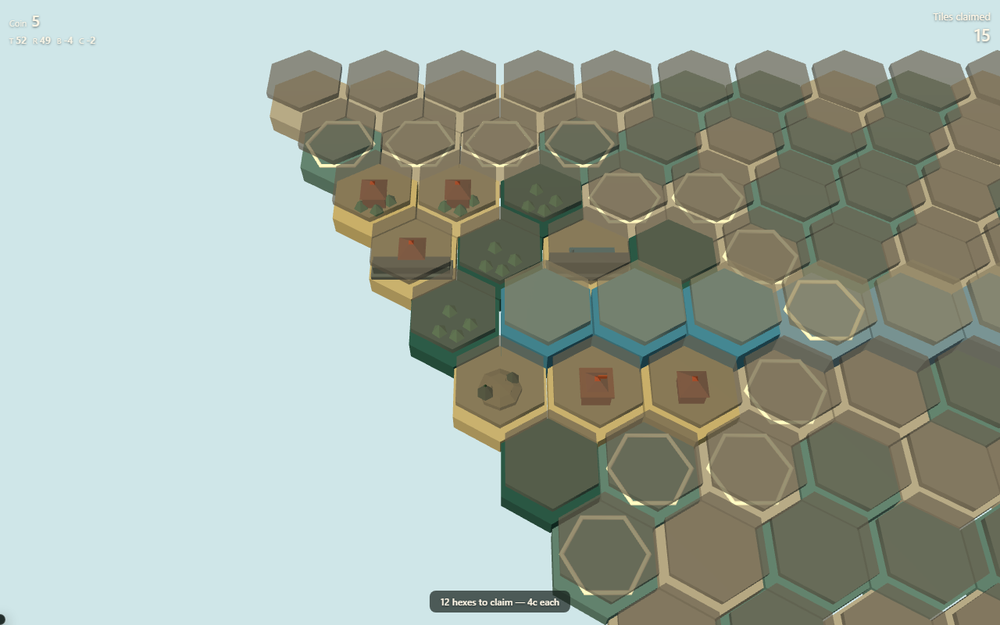

## v2.2 — Bucket A: UI/UX & playability — DONE

The v2.2 revision (Section 0.1) set a standing sequencing rule: no more
mechanical depth (hazards, terrain, elements) until every playability gap
found in review of the v2.1 build is fixed and verified. Full detail is in
`NEXT_STEPS.md`; summary here.

**Camera pan/zoom** (`src/render/scene.ts`): the camera was framed once at
boot and never moved again. Added pointer-drag pan (`panScale` tied to
camera distance so pan speed stays consistent at any zoom) and wheel zoom,
clamped to `[8, 40]` world units, no rotation (Section 6). Verified via
`tools/smoke.ts`'s `simpan` dev flag, which simulates a drag + wheel-zoom
headlessly and screenshots before/after.

**Popover clipping** (`src/ui/buildPopover.ts`): the build popover had no
viewport-bounds check, so it could render partly or fully off-screen near a
map edge. `show()` now positions it, measures itself with
`getBoundingClientRect()` in the same synchronous task before the browser's
next paint (no visible flash), and clamps within an 8px margin. Verified at
both top-left and bottom-right screen corners via the `testpopoverclip` dev
hook.

**Claim-anywhere** (`src/core/gameState.ts`, `src/main.ts`): Section 2's one
deliberate departure from Dorfromantik's adjacency rule — any unclaimed hex
anywhere on the fixed map can now be claimed directly, not just one
touching the existing footprint. `isClaimable`/`canClaim`/`claim` dropped
the adjacency check entirely; the old always-on frontier-ring display
(pointing at every claimable tile at once) is replaced by a single
hover-only ring, shown only under the cursor while it's over a claimable
tile and cleared immediately on claim. `tests/gameState.test.ts` and
`tests/balance.test.ts`'s scripted-playthrough harness (previously built
around the now-removed `claimFrontier()`) were reworked to match. Verified
with a headless Playwright click on a tile deliberately far from the
starting cluster (unclaimed count dropped 240 → 239, zero console errors)
and a screenshot of the hover ring rendering under the cursor at that
distant tile before the click.

**Unclaimed-tile visual distinction** (`src/render/terrainMeshManager.ts`):
the earlier dimming approach (scale HSL saturation down, nudge lightness
toward mid-gray) dimmed each tile *relative to its own terrain color*, so a
naturally light terrain (sand) dimmed still read lighter than a naturally
dark terrain (forest) at full color — legible tile-by-tile but not at a
glance across a mixed-terrain map, exactly what playtest flagged. Fixed by
blending unclaimed tiles hard (72%) toward the shared `fog` palette tone
instead of desaturating in place, so every unclaimed tile converges on
roughly the same hazy color regardless of terrain and claimed tiles stand
out as a group. Verified via default-zoom and zoomed-out screenshots.

**Verification:** 47/47 tests passing across 9 files, `tsc --noEmit` clean,
production build succeeds, zero console errors across every smoke-test and
one-off Playwright check run during this work.

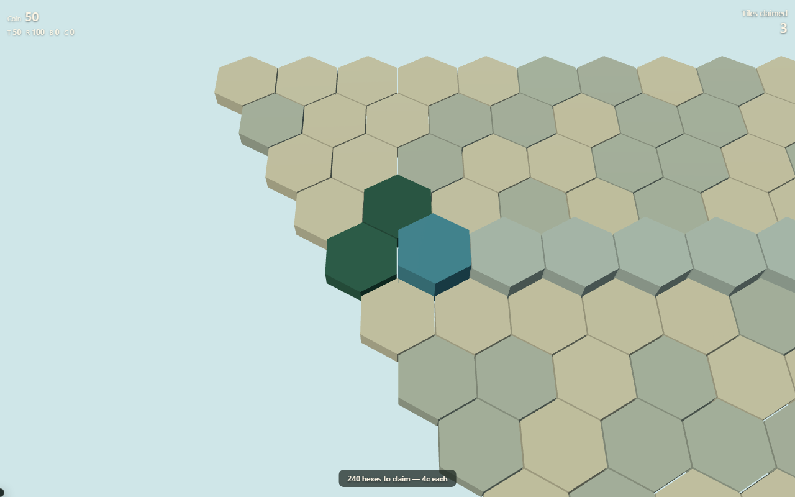
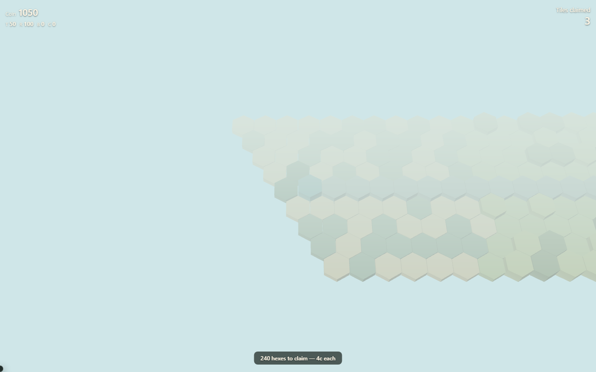

## v2.2 — Bucket B: trimmed content — DONE

With Bucket A clear, the v2.2/v2.3 revision's other standing requirement —
narrow the scope to coastal-only terrain, put a generic effects schema in
place as permanent architecture, and rebuild the roster around it — could
start. Full detail in `NEXT_STEPS.md`; summary here.

**Coastal-only terrain.** `src/data/terrain.json` now holds exactly four
terrains: Coast (sea, not buildable), Beach, River, Estuary. The 3-tier
elevation system (`coastal`/`midland`/`highland`) is gone along with every
terrain that needed it — `TerrainDef` carries a direct `height` field
instead. `/tools/mapgen/generate.ts` was rewritten from a WFC-lite
edge-matching solver into a deterministic authored layout: it finds the
sea-facing edge as a narrow band of world-X (so it renders as a straight
coastline despite axial skew — the same technique the old generator used
for its region bands), carves one continuous River with a near-greedy walk
from a single inland source to the nearest shore tile (which becomes the
one Estuary, "reaching the sea" per Section 4), and fills every remaining
tile Beach. `src/core/edgeTypes.ts` and its compatibility matrix are
deleted — nothing needs edge-matching once there's only one land terrain.

**Hazard spread moved from elevation to distance/adjacency.** The shared
BFS wave-propagation engine in `hazard.ts` already decayed by hop-count per
step, which is a form of graph distance — the only thing tying it to
elevation was flood's `canPropagate` gate (`toTier <= fromTier`, "never
flows uphill"). With no elevation tiers left, that gate is simply gone;
flood now spreads by adjacency/decay exactly like cyclone always did
(cyclone needed no change — Section 5 already specified no elevation
gating for it).

**Generic effects schema.** `buildings.json` + `defenses.json` merged into
one `src/data/elements.json` / `src/core/elements.ts`. Every element
carries an open `effects: { key: delta }` map instead of the old
building-only `coinPerTurn` field and defense-only `coBenefits: {
biodiversity, carbon, trust }` struct. `GameState.meterTotal(key)` is the
one generic accumulator — sums every standing element's `effects[key]`
weighted by maturity fraction, with no hardcoded meter names anywhere in
engine code. `biodiversity`/`carbon` are thin getters over it; Coin's
per-turn income goes through the identical path
(`this.coin += this.meterTotal("coinPerTurn")` in `advanceTurn()`). Adding
a new meter to the game means adding a key to an element's `effects` in
data, never new engine code. Absorption/failure/maintenance fields stay
explicit, structured fields — they're conditional mechanics (thresholds,
redirects, graceful degrade), not simple additive deltas, so folding them
into `effects` would have hidden real branching logic behind a
misleadingly generic-looking key instead of actually generalizing it.

**7-element roster + flat-silhouette icons.** The entire earlier
building/defense list is retired, replaced by: Dune, Sandy Vegetation
(Pandanus), Beachside Resort, Seawall (Beach); Mangrove, Khazan (Estuary);
Small Dam (River). Cyclone Shelter goes with the old roster — it's not in
the new one, so `resolveCyclone`'s Trust-shielding special case for it is
gone too; Trust is now charged uniformly per damaged building. Each element
gets a distinct flat-silhouette icon (`src/render/elementGeometry.ts`): a
2D outline built with `THREE.Shape`, extruded a shallow depth along Z. This
reads clearly specifically because Section 6's camera never rotates (pan/
zoom only) — a flat cutout's front face always faces the same fixed
viewing angle, unlike a rotating-camera game where it would go edge-on and
vanish. `defenseGeometry.ts`/`buildingGeometry.ts` and their near-identical
mesh managers merged into `elementGeometry.ts`/`elementMeshManager.ts`.

**One real bug found and fixed during verification:** Small Dam sits
directly on River terrain (Section 4's terrain assignment), but the flood
resolver unconditionally treated every River tile as a damage-skipping
hazard source ("the river never takes damage, it's the source") — so a dam
built there could never actually engage its absorption or failure-threshold
logic; `result.tileDamage.get(key)` came back `undefined` and
`destroyedDefenses` never included it, caught by the rewritten
`tests/hazard.test.ts`. Fixed by narrowing the skip condition:
`hazard.ts`'s flood `skipDamage` now only skips an undefended river tile
(`t === "river" && !state.elements.has(key)`), so a dammed river tile goes
through the normal defense-check branch at the source's full, undecayed
severity instead. A related, smaller gap: Mangrove and Khazan are
Estuary-only, and the fixed map has exactly one Estuary tile (Section 4:
"a single Estuary tile") which is already part of the starting claim by
construction — the balance-test harness's per-turn "build on the tile just
claimed" loop would never revisit it, so a hybrid-category scripted run
built zero defenses. Fixed with an opportunistic build pass over the
starting claim before the main loop starts, mirroring what a real player
would naturally do by opening the popover on their own starting tile.

**Verification:** 46/46 tests passing across 9 files (mapgen.test.ts,
hazard.test.ts, cyclone.test.ts, gameState.test.ts, buildings.test.ts,
scoring.test.ts, balance.test.ts, era.test.ts all reworked for the new
terrain/element model), `tsc --noEmit` clean, production build succeeds.
Screenshots below: a fresh map reading as a clean coastal strip with no
elevation stepping, and a built-out claim showing Mangrove's canopy-blob
icon, Small Dam's blocky-barrier icon, and Beachside Resort's
cabana-and-umbrella icon all rendering distinctly, zero console errors.

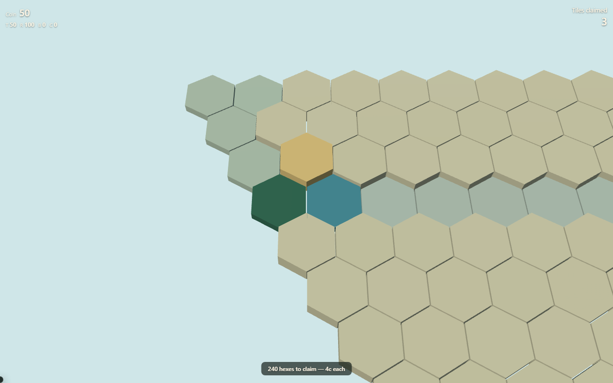
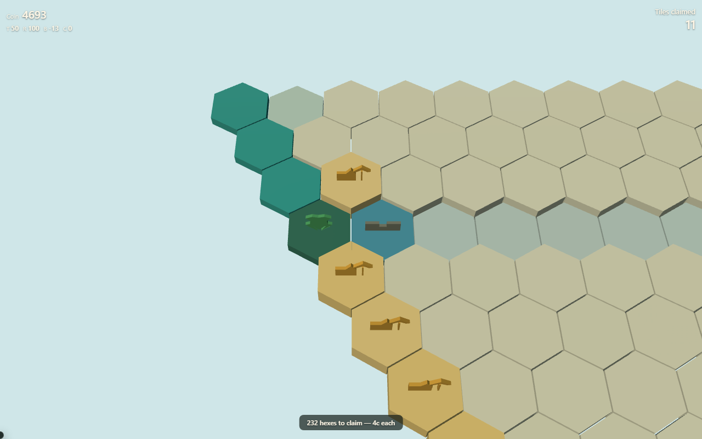

## v2.4 — Bucket A re-pass: popover state, dimming rebalance — DONE

A fresh live playtest against the committed build (`NEXT_STEPS.md`, no
v2.4 `GAUNTLET_PROMPT.md` found on disk — only stale v2.2/v2.3 copies in
Downloads, so this pass worked directly from the punch list's own detail)
re-opened two Bucket A items thought closed, plus found a genuine gap.

**A1 — build popover state management.** Root-caused with a live
Playwright session against the running dev server instead of guessing from
the bug report, which turned up something the report got slightly wrong:
auto-close-on-build already worked (`BuildPopover`'s button handler always
called `hide()`). The actual bug was that clicking an *already-built* tile
did nothing at all — `buildableAt()` correctly returns `[]` for an
occupied tile, and `show()` silently calls `hide()` on zero options, no
feedback either way. To a player re-clicking to check whether their build
"took," that reads exactly like "the popover never closed" — almost
certainly what the original report actually saw. Fixed by giving
`BuildPopover` a real `showInfo()` mode (name, category, effects, no
buttons) for occupied tiles, replacing the previous silent no-op — Section
3's "one tile, one element" is now enforced at the UI level, not just
inferred from the data layer never double-charging. Also added two
listeners that were missing outright: a `document`-level click listener in
`main.ts` (the old dismissal only lived on the canvas element, so a click
on the HUD — which sits on top of the canvas but isn't part of it — never
reached it) and an Escape `keydown` listener. All four behaviors
(auto-close, occupied-tile info, outside-click, Escape) verified via a
live Playwright session reading actual DOM state, not just source code.

**A2 — unclaimed-tile dimming, rebalanced.** The previous pass's fix
(blend 72% toward one shared `fog` tone) solved the problem it was aimed
at — claimed vs. unclaimed being obvious — a little too well: different
*unclaimed* terrain types converged close enough together that a wide,
mostly-Beach view read as one flat tan field, which is what this pass's
playtest flagged. `terrainMeshManager.ts`'s `dim()` now desaturates each
terrain's own color first (`saturation * 0.55`, keeping enough of its own
hue to stay distinguishable from other terrains) before blending a smaller
32% toward fog — both problems solved by the same function instead of
trading one for the other. Screenshots confirm unclaimed Coast now reads
as clearly blue-teal against unclaimed Beach's tan. Logged honestly: the
map's *interior* still looks Beach-monotonous at wide zoom because it
genuinely is almost all Beach at today's coastal-only scope — that's
Bucket B's job (adding Land), not a color bug.

**A3 — icon roster: 7/8, one genuinely blocked.** The 7 elements that
exist today already have distinct icons from the earlier trimmed-roster
pass, reconfirmed legible via screenshot. The 8th, House, doesn't exist as
an element until Bucket B's B2 item adds it — deferred rather than
manufacturing a placeholder element early just to check a box, which would
have meant reaching into Bucket B content before Bucket A was actually
done, the exact ordering Section 0.1 exists to prevent.

**Verification:** 46/46 tests passing, `tsc --noEmit` clean, production
build succeeds. All three items confirmed via live Playwright sessions and
screenshots, not static code reading alone — A1 in particular would have
been reported "fixed" wrongly if verified only by re-reading the source,
since the actual bug (occupied-tile click) looked identical to the
originally-reported one (stale popover) from the outside.

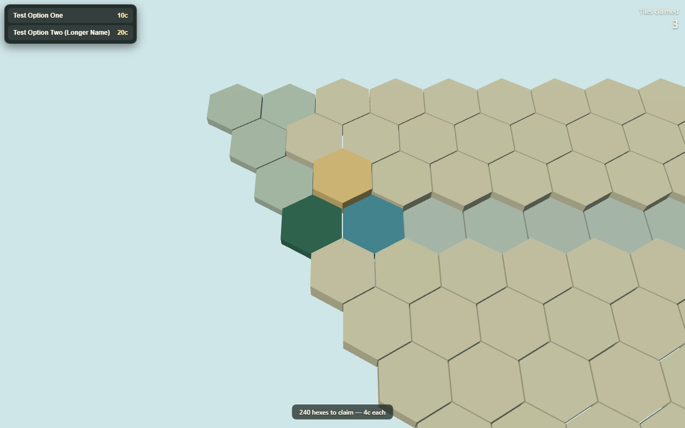
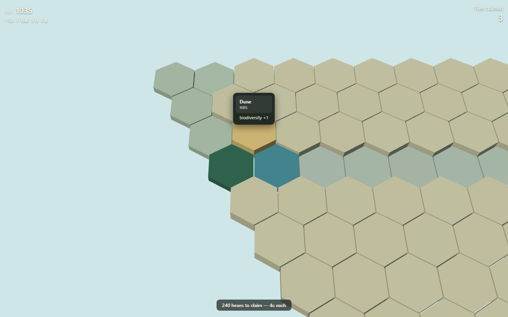
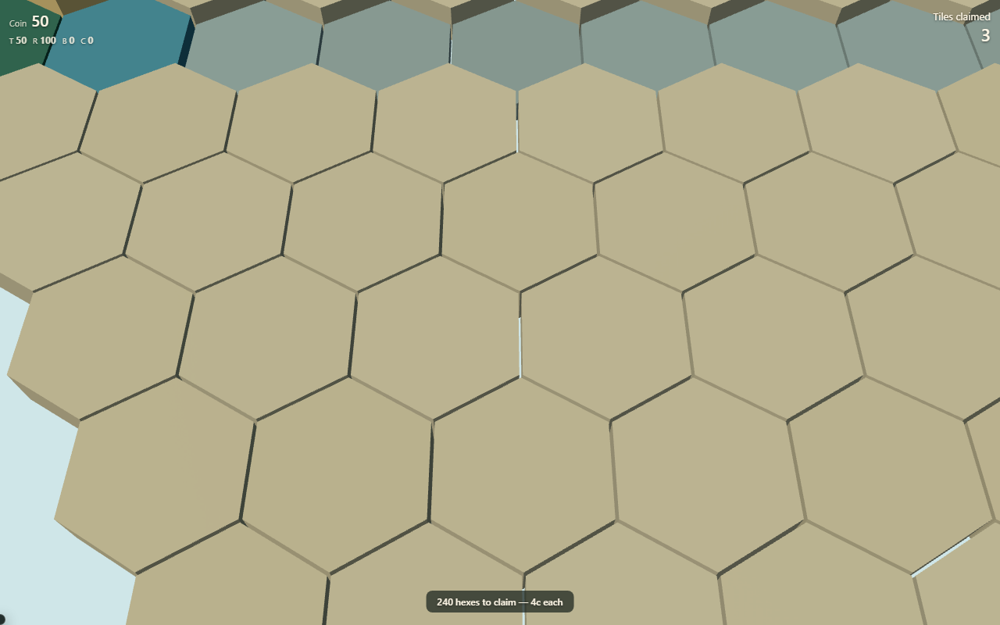

## v2.4 — Bucket B: Land terrain, House/Food/Population, new starting state — DONE

With Bucket A clear, this pass worked through the punch list's Bucket B:
a real map-generation bug, a wider element roster, and a new starting
state. Full detail in `NEXT_STEPS.md`; summary here.

**B1 — the "sea wraps around a corner" bug, root-caused.** `/tools/mapgen`
banded Coast/Beach by comparing each tile's world-X against a single
*global* threshold derived from `xMin` — but `xMin` (the minimum world-X
across the whole grid) is only actually achieved at one corner
(`q=Q_MIN, r=R_MIN`), because `axialToWorld`'s `x = sqrt3*(q + r/2)` means
every row's own local x-range is shifted by that same `r/2` term. A
narrow global threshold therefore selects lots of tiles from the rows near
that one corner and almost none from the rows near the opposite corner —
exactly "sea wraps around a corner," and a bug that predates this pass
(the v2.2 coastal-only mapgen rewrite had the same threshold logic, just
never caught). Fixed by banding on axial `q` directly instead: identical
q-range selected in every row, so the edge reads as one smooth line (a
gentle diagonal, since the hex grid's own skew makes same-q hexes drift
together row to row — a reasonable stand-in for "Goa's gently curved
shore," which was the aesthetic goal anyway). Added `land` as a 5th
terrain (`src/data/terrain.json`, new `landGreen` palette color), rewrote
the region rules for the explicit Sea → Beach → Land → Estuary/River
order, and made the estuary a genuine branching blob — two river arms
from separate east-edge sources converging on a shared confluence inland,
the confluence plus its neighbor ring becoming Estuary — confined to the
eastern ~38% of the map rather than touching the coast. `tests/mapgen.test.ts`
was rewritten to independently re-verify the new layout by reading the
checked-in `map.json` directly (every row's terrain order, the estuary's
connectivity and region bounds), not just trusting the generator's own
self-check.

**B2 — the 8-element roster.** Added House (`validTerrainIds: ["land"]`,
`kind: "building"`, `effects: { money: 5, food: -1, population: 5 }`) —
`buildCost: 25` and `money: 5` are invented placeholders, no value was
specified for either, flagged here as such, not tuned balance. The
`population` key goes beyond what was literally specified for House, added
because it lets B3's "population scales with House count" go through the
exact same generic `meterTotal` accumulator every other meter already
uses, instead of a one-off hardcoded element-id check breaking the
pattern. Widened Beachside Resort to `["beach", "estuary", "river"]`, and
added `food: 1` to both Mangrove and Khazan. Renamed the generic effects
key `coinPerTurn` → `money` everywhere (`elements.json`, `GameState.
advanceTurn`) — the two were the same concept under different names, and
this document's own terminology should win. House's icon (a wide
gable-roofed silhouette with a chimney — squatter and plainer than
Resort's cabana-and-umbrella, reading as "ordinary residential" rather
than "beach amenity") closes out A3's deferred 8th icon.

**B3 — Population/Food and a new starting state.** `GameState` gained
`food` and `population` getters, both thin wrappers over `meterTotal`
(the same pattern as `biodiversity`/`carbon` — no new hardcoded engine
logic for either). The constructor gained two new optional parameters,
`startingElements` (pre-built elements claimed and placed for free, not
purchased — a `{coord, elementId}` seed list) and `startingCoin`, both
re-applied inside `startNewEra()` too, so the pre-built Houses and the
1,000 starting Coin survive an era transition rather than only existing
once at first boot. `/tools/mapgen` now also writes
`src/data/startingState.json` (`startingCoin: 1000`, `startingPopulation:
50`, and 10 `prebuiltHouses` coordinates — a compact Land-tile cluster
computed from the same generated map, just inland from the coastal
starting claim, guaranteed to actually be Land rather than hand-picked
blind). `main.ts` loads this file, passes it into `GameState`'s
constructor, and renders the pre-built Houses at boot with no settle
animation (they were never "just built" — the player already owns them).
`Hud` gained Food and Population chips alongside the existing four.

**Verification:** 49/49 tests passing across 9 files, `tsc --noEmit`
clean, production build succeeds. `b1_fresh_map.png` shows a clean
Coast → Beach → Land band with no corner artifact; the branching
river/estuary system itself is far enough east that it fell outside every
attempted screenshot pan, so it's verified by `tests/mapgen.test.ts`
reading the checked-in map data directly instead (connectivity, region
bounds, ≥3-tile blob size) rather than by eye. `b3_fresh_start.png` shows
a fresh load with Coin 1000, HUD reading "F -10" / "P 100" (10 Houses ×
their food/population effects), "Tiles claimed: 13" (3 coastal + 10
Houses), and 10 House icons visibly clustered on Land just inland from the
coastal claim — every number and every visual matching what the
starting-state config actually contains, not just "looks about right."

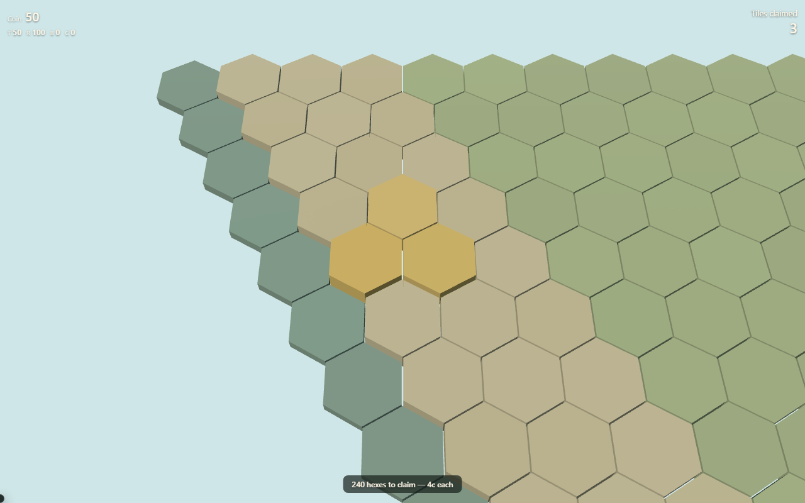
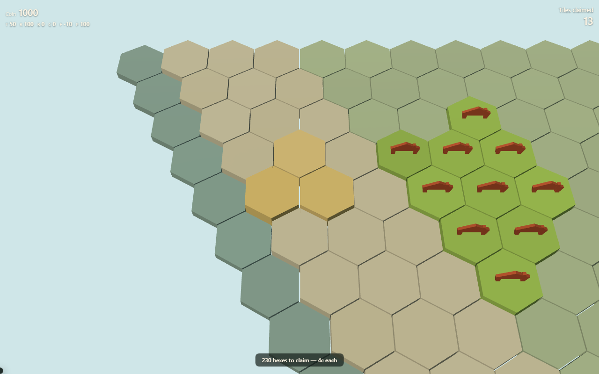

## v2.4 re-pass 2 — a second fresh playtest found deeper bugs under the surface — DONE

A second live playtest (more thorough than the first) re-confirmed A1 with a
new, worse symptom (clicks passing through a stale-looking popover to the
map underneath), and reported two new critical items: A4 ("claiming prints
money") and A5 ("Mangrove-on-Estuary charges Coin, builds nothing"). B1 also
came back with much stronger evidence that the previous corner-wrap fix
hadn't actually fixed the underlying geometry problem. All five investigated
this pass; three were genuine bugs with real root causes, one turned out not
to be a bug at all, and one (A5) turned out to be a *different*, deeper bug
than anyone had diagnosed.

**A1, for real this time.** The previous "fix" tracked open/closed state
correctly the whole time — the bug was CSS: `.build-popover { display: flex; }`
is an author-origin rule, and author rules always beat the user-agent
`[hidden] { display: none }` default regardless of selector specificity. So
`el.hidden = true` updated the DOM attribute but the popover kept rendering
at full opacity. Fixed with an explicit `.build-popover[hidden] { display:
none; }` override, plus the modal backdrop the user explicitly asked for: a
full-viewport `.popover-backdrop` that intercepts every click while a
popover is open, so a click anywhere except the popover's own content always
just closes it — the "stale popover, click leaks to an unrelated tile"
scenario is now structurally impossible rather than merely guarded against.
`BuildPopover` was restructured around this (`isOpen` now reads the
backdrop's `hidden`, not the popover box's), and `main.ts`'s old
document-level outside-click listener (a patch around the CSS bug from the
previous pass) was removed — the backdrop subsumes it.

**A4 — investigated, not a bug.** Claiming a hex nets +46 Coin instead of
charging the displayed 4c. Traced it: `claim()` is the sole call site of
`advanceTurn()` (the "one claim = one turn" design from earlier phases),
so a claim both pays the -4 cost *and* collects that turn's income from
every standing element — at the starting state, 10 Houses × `money +5` =
+50. Net `-4 + 50 = +46`, exactly the reported number, independent of
which tile/terrain is claimed. Both halves are individually correct and
intentional; decoupling them would either kill per-claim income (breaking
the just-verified B3 economy loop) or require inventing a second turn
trigger with no spec basis. Left the mechanic alone and documented the
math in `NEXT_STEPS.md` rather than silently redesigning turn cadence —
this is a case where the investigation's conclusion diverges from the
original bug report's framing, so it's flagged explicitly rather than
folded in as a quiet fix.

**A5 — the actual find of this pass.** The reported symptom (Mangrove
build charges Coin, renders nothing, re-click still shows a build menu)
looked at first like a build-confirmation bug. Isolated tests proved
otherwise: `GameState.build()` and `ElementMeshManager.place()` both work
perfectly for Mangrove when driven directly, no click involved. That
pushed the investigation into click handling itself, where live debug
tracing (temporary, since removed) found the raycaster returning zero
hits at screen positions visibly, unambiguously over Estuary tiles —
confirmed by comparing against a manual straight-down ray to the same
world coordinates, which hit correctly every time, with an unstale camera
matrix and correct instance positions on both sides.

The actual mechanism: `THREE.InstancedMesh.boundingSphere` is computed
lazily on a mesh's first raycast or first frustum-culling check, then
cached forever — nothing in Three.js invalidates it as instances move.
`TerrainMeshManager` and `ElementMeshManager` both animate tiles/elements
into place via a shared `SettleAnimator`, which keeps calling
`setMatrixAt()` well after that first snapshot. When a mesh's first
bounding-sphere computation happens to land mid-animation — as it
reliably does under `?autoclaim=N`, which fires many claims synchronously
before the first render frame, freezing several instances at their
elevated "drop-in" starting transform — every later click against that
mesh gets silently rejected by a broad-phase bounds check against a
sphere that no longer describes where the geometry is. This is a general
engine-level bug, not specific to Mangrove or Estuary; it surfaced there
because of this repro's specific claim timing. Fixed in
`SettleAnimator.tick()`, which now invalidates (`mesh.boundingSphere =
null`) every mesh it touches each tick an animation is in flight, plus
defensively at the two other places `TerrainMeshManager`/
`ElementMeshManager` write instance matrices directly
(`resetClaims()`, `place()`'s non-animated branch). Re-verified the
original repro end-to-end after the fix: Coin -30, popover auto-closes,
re-click shows a Mangrove info card with `food +1` — confirming B2's
Mangrove Food effect and A1's auto-close were both already correct; they
just couldn't be reached because the click that should have re-selected
the tile was the one being silently swallowed.

**B1, actually fixed this time.** The previous corner-wrap fix addressed
a narrower symptom but left the deeper cause untouched:
`axialToWorld`'s formula (`x = √3·(q + r/2)`) has a shear term in `r`, so
a plain rectangular range of axial coordinates does not render as a
rectangle in world space — it renders as a parallelogram, sheared further
the more `r` moves from 0. With a fixed, non-yawing camera, that reads
exactly as this pass's report: a wedge-shaped landmass with Sea on every
side and a diagonal "vein" instead of a straight band. Fixed with
row-offset coordinates in `tools/mapgen/generate.ts`
(`rowQMin(r) = Q_MIN - floor(r/2)`), which exactly cancels the shear, so
every row's west edge lands on the same world-space x within one natural
half-hex stagger — confirmed by a new sanity check whose measured drift
came back at exactly √3/2, the theoretical value. All banding/scoring
logic was ported from raw `q` to a new `colIndex(c)` (position within its
own row), since raw `q` is no longer comparable across rows once each
starts at a different offset. `tests/mapgen.test.ts` gained a matching
rectangle test.

**A2 and A3 re-checks.** A2 (unclaimed-vs-claimed contrast) got the
dedicated side-by-side re-check the user explicitly asked for: claimed one
isolated tile of each terrain type and screenshotted it against its
unclaimed neighbors — all four (Beach, Land, River, Estuary) are clearly
distinguishable by color/saturation, closing this out for real rather than
on a hopeful note. A3's House icon (previously deferred, then reported as
reading like "a bench, a couch, or a wagon") was rebuilt from a flared-eave
shape with a baseless notch to a plain pentagon-plus-chimney "home"
pictogram — confirmed by screenshot.

**Verification:** 50/50 tests passing across 9 files, `tsc --noEmit`
clean, production build succeeds. All fixes re-verified live via headless
Playwright against the actual running game (not just unit tests) — the
A1 backdrop's click-interception, A5's raycast fix end-to-end through a
real build, and A2's four-terrain contrast were each confirmed by
screenshot or `getComputedStyle` inspection of the live DOM, not assumed
from the code alone.

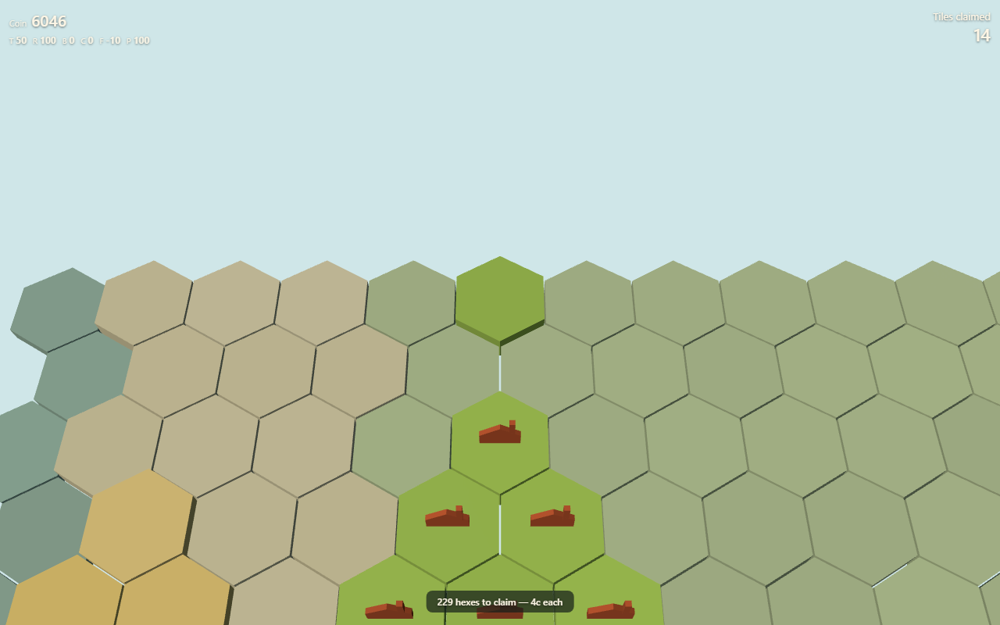
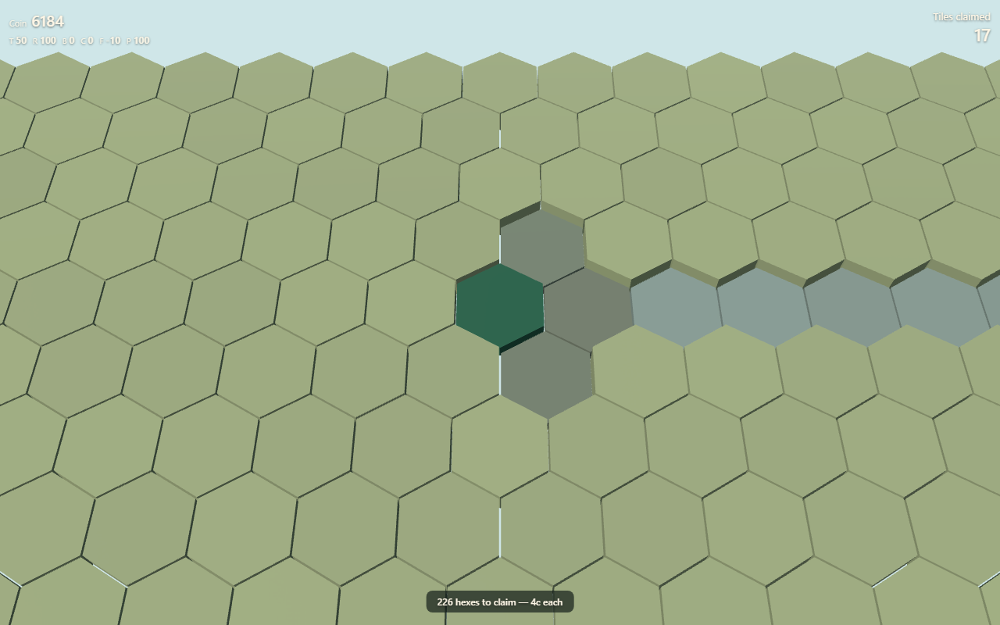

## Step prompt — readability pass, Panaji/Taleigao reference map, River roster change — DONE

Worked `STEP_PROMPT_visuals_map_river.md`'s three items in order (1 and 2
first as instructed, since they're cheaper); each independent of the
others.

**1 — Color theme & readability.** The step prompt's own grayscale
measurement of the live build was damning: claimed vs. unclaimed Beach
differed by exactly 1 point of luminance (178 vs. 179) — invisible in
grayscale and a real accessibility failure, not a subjective complaint.
Root-caused to two compounding problems, both fixed:
1. **`palette.ts`'s base colors were under-saturated** for a "Goan, not generic-tropical" palette — deepened/punched up every terrain color and re-spread their grayscale luminance further apart (mangroveTeal ~72, seaTurquoise ~93, riverBlue ~117, landGreen ~162, sandGold ~189 — these are the CLAIMED/full-color values).
2. **`terrainMeshManager.ts`'s `dim()` function was structurally incapable of guaranteeing a real gap.** Its "blend toward `fog`" approach can never darken a terrain that's already close to `fog`'s own brightness (exactly Beach's problem). Rewrote it to drop lightness by a *proportional* multiplicative factor instead (`l * 0.3`) rather than blending toward anything or subtracting a fixed amount — a flat-subtraction version was tried first and hit a second, subtler bug: `THREE.Color.getHSL()` runs in a color-managed working space where mangroveTeal's actual `l` measures ~0.06, *below* that version's own floor meant to protect dark colors from crushing to black, which made the floor clamp mangrove's *unclaimed* state brighter than its *claimed* state. A proportional cut sidesteps the whole bug class — multiplying any positive `l` by a factor < 1 always reduces it, no floor needed, regardless of which color space or absolute range `l` lives in.

Built `tools/verify_readability.ts` (new, permanent — `npm run
verify:readability`) as the "scripted, repeatable part of the test suite"
item 1 explicitly asked for: it claims one tile of each buildable terrain
type, pans the camera via a small always-present `window.
__focusOnForTest` hook (harmless, costs one property assignment) so the
tile sits at screen center, and reads the REAL rendered pixel color
straight off the live WebGL canvas via `gl.readPixels` — needs
`preserveDrawingBuffer: true` on the renderer (`scene.ts`, added this
pass) since a completed frame isn't guaranteed to survive outside the
render loop otherwise. Asserts every terrain's claimed/unclaimed
grayscale luminance delta clears 30 points. Getting this tool itself
correct took real debugging — an early version sampled at world Y=0
(ground level) instead of each terrain's actual top-surface height,
which can catch a taller neighbor's face instead of the intended short
tile (River/Estuary sit at height 0.3, squeezed next to Land's 0.55); a
later version picked candidate tile pairs by array index rather than hex
distance, which for a small feature like Estuary (every tile mutually
adjacent) risked anti-aliased edge-bleed from the just-claimed tile
corrupting the "unclaimed" reading right next to it. Both fixed by
sampling at the correct world Y and picking the maximum-hex-distance
pair among candidates.

Final measured deltas (all comfortably over the 30-point threshold):
Beach 63.8, Land 52.8, River 34.5, Estuary 31.1.

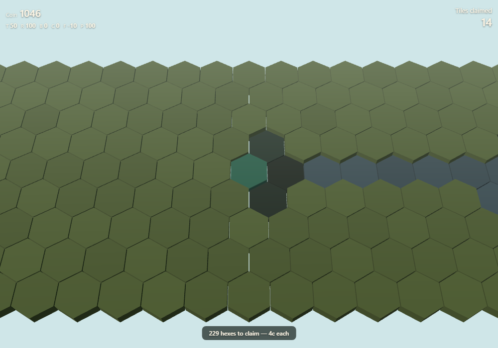

**2 — Smaller map, Panaji/Taleigao likeness.** Cut the generated map from
243 hexes (27×9) down to **105 hexes (15×7)** — comfortably inside the
suggested 80-120 range, still "wider than tall" per Section 8. Baked the
reference schematic's most distinctive feature — a wide, rounded estuary
mouth with the Land plateau curving around it rather than a flat
rectangle — into the region rules: the Land/water-zone boundary column
now varies per row via a "bulge" function, pulling the water zone west
(narrowing Land) near the estuary's own latitude and tapering back to
the baseline a couple of rows either side, clamped so Land never drops
below a minimum width even at the bulge's peak. The estuary ring itself
was also relaxed to bite into what the column bands alone would call
Land (rather than being confined strictly to the pre-computed water
zone), so the mouth reads as a genuine wide blob (7 tiles) rather than a
narrow 2-tile notch on this smaller map. `tests/mapgen.test.ts`'s
"eastern ~38%" check was loosened from a fixed global percentage to a
generic "eastern third" bound, since the exact per-row boundary is now
an internal tuning knob the test shouldn't hardcode — the real invariant
(Coast→Beach→Land before any Estuary/River, independently re-verified
per row) was already covered by a separate test and needed no change.
New counts: coast 7, beach 14, land 65, river 12, estuary 7.

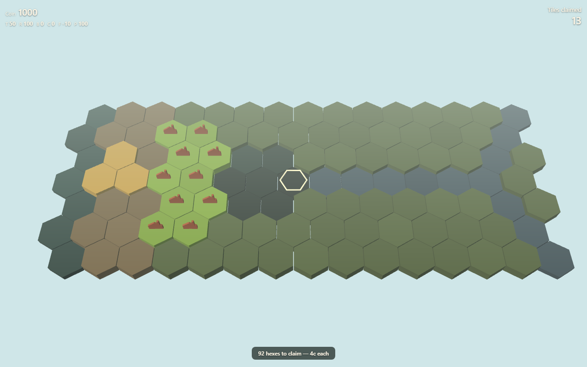

**3 — River roster: Small Dam + Sand Mining only.** Reverted Beachside
Resort's v2.4 River eligibility (back to `["beach", "estuary"]`). Small
Dam's role flipped from "trades away flood defense for income" to a real
flood-control structure: added `effects.resilience: 5` (positive) and
`effects.money: 8` — the latter wasn't actually present in the live data
despite being described in both `GAUNTLET_PROMPT.md` Section 4 and this
step prompt's own "unchanged from earlier revisions" phrasing, so this
pass added it to match the documented role, not just flip a sign that
turned out not to exist yet. Its `absorptionAtMaturity`/`failureThreshold`
fields (0.75 / 1.15) — the fields hazard.ts actually reads today — were
left unchanged; they were already strong, i.e. Small Dam was *already*
mechanically flood-positive in practice, just not reflected in its
`effects` map. The new `effects.resilience` key isn't consumed by any
code yet (the generic-effects-driven local/zone resolution model is a
documented but not-yet-built v3.0 phase — see `GAUNTLET_PROMPT.md`
Section 0.1/12) — it's forward-compatible data, added because the
standing architectural rule is that every element's impact goes through
that one generic map, not because it changes today's hazard math.

Added **Sand Mining** (`buildCost: 35`, `matureTurns: 0`, `effects:
{money: 14, biodiversity: -3, resilience: -4}`, all placeholder
magnitudes) as the "pure income at a real cost" role Small Dam used to
carry alone. Its actual in-engine flood behavior comes from a genuinely
mechanical (not just cosmetic) choice: giving it `targetsHazards:
["monsoon_flood"]` with a near-zero `absorptionAtMaturity` (0.1) means
building it on a river tile makes that tile stop being treated as an
undamaged flood *source* (which `hazard.ts`'s `skipDamage` rule exempts
entirely — an untouched river tile takes zero damage, since it *is* the
flood, not a victim of it) and start taking near-full flood damage
instead — a real, engine-verified "resilience −" outcome using existing
mechanics, not just a label. New icon (a jagged sand-pile-with-scoop
silhouette, distinct from Dune's smooth mound and Small Dam's low flat
barrier) and a new warm sandy-orange `defenseSandMining` palette color
(distinct from the cool-gray `defenseEngineered` family Small
Dam/Seawall share) — both needed for `createElementGeometry` not to
throw when a player actually tries to build it.

The step prompt itself flagged a real, not-yet-settled balance question:
as specified, Small Dam is close to strictly better than Sand Mining
(money either way, plus a Resilience benefit instead of a cost, for the
same Biodiversity cost). This pass's answer — Sand Mining costs less to
build (35c vs. 55c) and returns meaningfully more Money (14 vs. 8) — is a
first-pass placeholder tuning, not a balance-tested one; a new test
(`tests/buildings.test.ts`) checks these two levers specifically, not
that the wider balance question is resolved.

Verified live: a claimed River tile's popover now offers exactly Small
Dam and Sand Mining (no Beachside Resort); building Sand Mining and
re-clicking shows its info card with `money +14 · biodiversity -3 ·
resilience -4` — the popover picked up the new `resilience` key with no
UI code changes at all, confirming the generic-effects display really is
fully data-driven. A new scripted flood test confirms a Small-Dam-
defended river tile now reduces downstream damage relative to an
undefended one (`tests/hazard.test.ts`) — the reverse of the "trades
away defense" framing from earlier revisions.

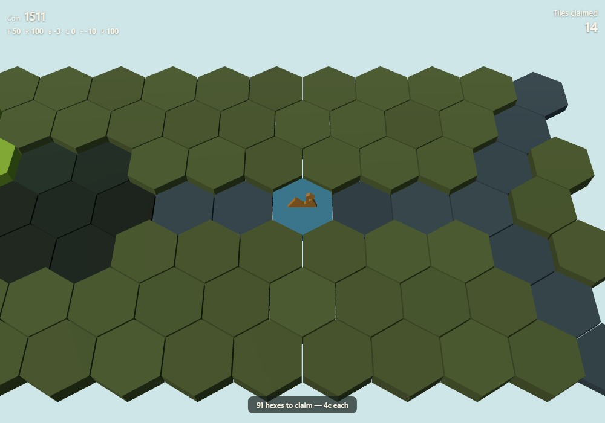

**Verification:** 53/53 tests passing across 9 files (3 new: River's
exactly-two-options menu, Small Dam/Sand Mining's effect directions and
relative tuning, and the downstream-damage comparison), `tsc --noEmit`
clean, production build succeeds.

## Step prompt — element icon redesign (all 9 elements) — DONE

Replaced every buildable element's placeholder mesh with a properly
designed one, per `STEP_PROMPT_icons.md`'s 2D-silhouette-first
design review. Visual/geometry only — confirmed via the full test suite
(53/53, unchanged) that no `elements.json` field (`effects`, `terrain`,
`buildCost`, or anything else) moved.

**Construction technique changed, not just the shapes.** Every earlier
icon (this project's whole history so far) was a thin flat cutout — a 2D
polygon extruded a shallow ~0.09 depth, standing upright on the tile like
a cardboard sign. This pass's brief was explicit: real low-poly 3D
volumes (boxes, tapered prisms, cones, domes), matching the construction
language the hex-prism terrain already uses, not more of the same
cutout technique with fancier outlines. New `src/render/primitives3d.ts`
holds the reusable pieces (`box`, `taperedSlab`, `coneFrustum`, `dome`,
`blade` for the remaining thin angled parts — grass tufts, fronds, prop
roots, arms — plus `rotate`/`move` helpers), each baking a real
per-vertex `color` attribute so a single element can have multiple
distinctly-colored parts (a dune's paler back ridge vs. darker front
ridge, a house's cream wall vs. laterite roof) without needing a
separate material or draw call per part — `ElementMeshManager`'s material
gained `vertexColors: true` to read it, composed with the existing
per-instance `jitterColor` tint (still applies on top, multiplicatively,
for the same "not perfectly uniform" variety as before).

**A real bug surfaced building this, not just new shapes:**
`THREE.BufferGeometryUtils.mergeGeometries()` silently returns `null`
(logs a console error, doesn't throw) when mixing indexed and
non-indexed geometries in one call — `ExtrudeGeometry` (used by
`taperedSlab`/`blade`, for the trapezoid/wall/wedge shapes) comes out
non-indexed, while `BoxGeometry`/`CylinderGeometry`/`SphereGeometry`
come out indexed, so any element mixing both families — nearly every one
of the nine — would have failed to merge, throwing downstream ("Cannot
read properties of null") the first time `ElementMeshManager` tried to
construct its meshes at boot, not at the specific broken element's build
site. Fixed once, centrally, in `primitives3d.ts`'s shared `paint()`
helper (`geometry.toNonIndexed()` before every geometry gets its color
attribute) rather than requiring every individual builder function to
know about it.

**Per-element notes, only where something needed a second pass:**
- **Beachside Resort vs. House** — the step prompt's own explicit ask. First live side-by-side screenshot found the flat-roof/window-grid cues read as a different *kind* of building but not obviously *bigger* — a real, worth-catching gap between "the geometry is technically taller" and "a player glancing at the map would call it taller." Pushed the main block height from 0.62 to 0.95 (vs. House's wall-plus-roof-peak total of ~0.58) and rescaled the window grid proportionally so three rows stay spread across the now-taller face rather than clustering in the lower half. Re-verified: the height difference reads as unmistakable now, alongside the flat parapet roofline (vs. House's peaked gable) and the 3×3-minus-one window grid.
- **Sandy Vegetation (Pandanus)** — built exactly to the settled "minimal single" spec: one tapered trunk, an 8-blade rosette drooping outward/downward (alternating two leaf tones), two angled prop-root struts. Reads as a distinct spiky plant, not a bush or a palm, at both close and normal zoom.
- **House** — the "Goan cottage": wall block under a gable roof genuinely wider than the wall (the overhang is the point), a lean-to veranda slab at the front, two window insets. The pre-existing starting cluster (10 pre-built Houses) picked this up automatically with no other code changes, since it's the same shared geometry.
- Every other element (Dune, Seawall, Mangrove, Khazan, Small Dam, Sand Mining) built to its spec's silhouette/color description directly — no second-pass issues found in live verification.

**Poly counts** (triangles per instance, read directly off the live
meshes): dune 196, sandy_vegetation 144, beachside_resort 388, seawall
48, mangrove 240, khazan 144, small_dam 60, sand_mining 168, house 72.
**Flagging Beachside Resort as meaningfully heavier than what it
replaced** (its old flat-cutout version — cabana + pole + canopy — was
roughly 56 triangles; the new hotel is ~7x that), a direct consequence
of it being the most detailed silhouette in the roster (8 windows +
sills, parapet + trim, awning + door, pennant pole + flag, pool +
highlight, a full palm). Every other element also grew (roughly 2-4x
their old flat-cutout versions) simply from being built as real 3D
volumes with multiple parts instead of thin single-depth cutouts. None
of this is a real performance concern at this project's scale — even at
the per-type instance cap (200), Resort's worst case is ~78k triangles,
comfortably within budget for any target hardware this pilot cares
about — but flagged as asked, since the increase is real and Beachside
Resort specifically is the standout case.

Verified live: built all nine elements via a scripted playthrough and
screenshotted at both normal-zoom (all nine visible, terrain-adjacent,
no silhouette reading as a flat colored blob) and close range
(House-vs-Resort specifically, per that item's explicit verify note).

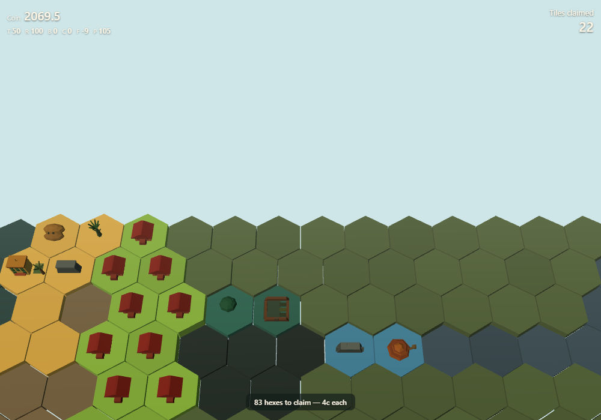
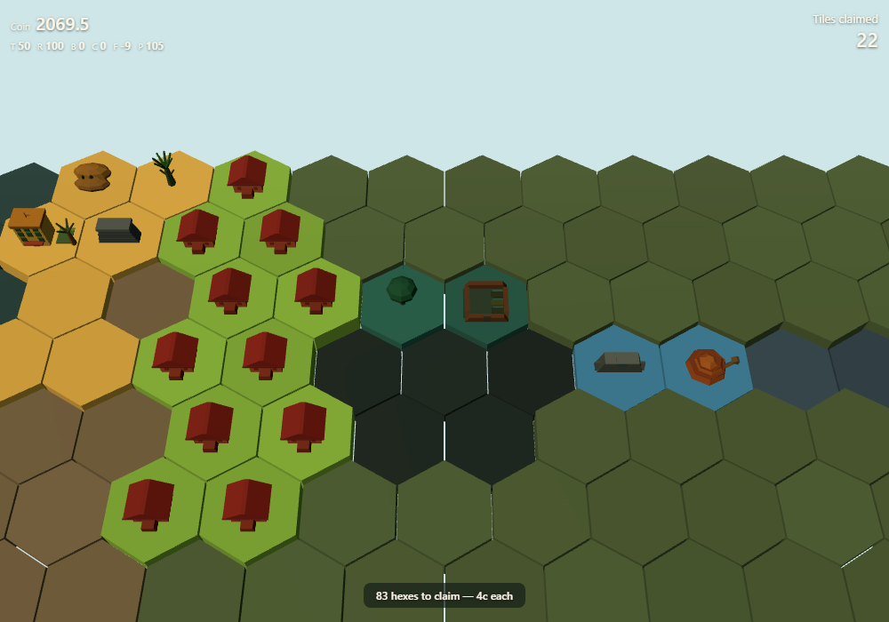
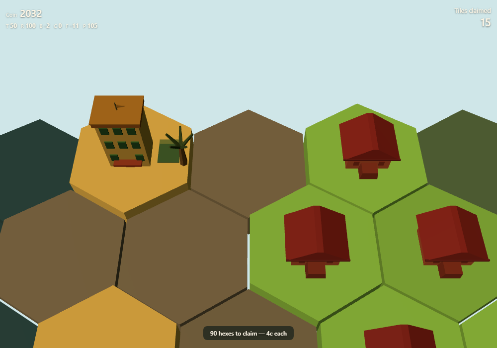

**Verification:** 53/53 tests passing (unchanged — confirms no data
fields moved), `tsc --noEmit` clean, production build succeeds.

## Step prompt — economy expansion, food pressure, estuary widening, Yacht achievement — DONE

Worked `STEP_PROMPT_economy_food_yacht.md`'s four items. Per that
document's own instruction, this lands *before* re-running/refining
`STEP_PROMPT_balance_tuning.md`'s harness — the numbers below are all
explicitly placeholder, same convention as every prior pass, meant as
the harness's next input, not a finished tuning.

**A stale-assumption finding worth flagging up front.** Item 3 asked to
widen the Estuary region to "roughly 4-6 tiles," citing `tests/
balance.test.ts`'s comment that the map has "exactly one Estuary tile."
Checked directly against the live map before touching mapgen: the
current map already has **7 Estuary tiles** (from the earlier Panaji/
Taleigao mapgen reshape — see that pass's own PROGRESS.md entry), and
they're no longer even part of the starting claim (that's a separate
coastal Beach cluster now). The step prompt's premise was accurate for
an older map, not the current one — `tests/balance.test.ts`'s comment
was simply never updated when that earlier pass landed. Closed this item
by fixing the stale comment (and confirming the actual test logic never
hardcoded the assumption — it already searches the whole map generically
for qualifying tiles) rather than re-touching mapgen for a difference of
0-3 tiles from an approximate target, which would just undo already-
screenshotted, already-approved region shape work for no real gain. 7
tiles comfortably satisfies the item's actual goal ("enough room for
several Khazans plus at least one Mangrove").

**1 — Mangrove earns Coin too.** Added `effects.money: 1` to Mangrove
(previously had no money key at all) and bumped Khazan `1 -> 2`, so all
four money-generating elements now land on distinct values: Sand Mining
14 > Beachside Resort 5 > Khazan 2 > Mangrove 1. **Placeholder
magnitudes** — the point of this pass is the ordering and the fact all
four differ, not that `2`/`1` are correct; feeds into the balance-tuning
harness next.

**2 — Food pressure.** `GameState.advanceTurn()` now drains Trust
(`deficit * 0.4`) and Resilience (`deficit * 0.15`) every turn a Food
deficit is running — both **placeholder factors**. Deliberately never a
hard block: claiming and building both stay fully available regardless
of how deep the deficit runs, per the design brief's explicit "12-year-
old can play this" constraint. Updated the `food` getter's now-stale
comment (it used to say a deficit "doesn't block anything until a
hazard/outcome pass decides what it should do" — that pass is this one).
HUD: the Food chip (`hud.ts`/`hud.css`) now switches to a warm red-orange
warning color whenever `food < 0`, confirmed live in actual play (not
just a scripted check) — the starting state's 10 pre-built Houses with
no Mangrove/Khazan yet is itself a real deficit, and the chip lit up
correctly from a fresh load.

**3 — Estuary widening.** Already satisfied — see the stale-assumption
finding above. No mapgen changes this pass.

**4 — Yacht: a pure cosmetic achievement.** New `ElementKind` member,
`"cosmetic"` (`core/elements.ts`) — zero category/targetsHazards/
absorption fields, an empty `effects` map, confirmed via a new test that
`meterTotal()` reads identically with or without one placed. Lives on
Coast (`validTerrainIds: ["coast"]`), the one terrain nothing else builds
on, so it doesn't compete for tile space with anything. `buildCost: 750`
is a **placeholder** — "a genuine long-run savings target," not tuned.

New hull/mast/sail construction in `elementGeometry.ts`, and a new
primitive, `primitives3d.ts`'s `plan()` — every earlier primitive builds
a shape in the XY plane extruded along depth (a wall, a standing-upright
panel), the wrong orientation for something meant to sit flat and low
like a hull; `plan()` takes a top-down (X,Z) footprint and extrudes it
upward instead. Found and fixed a real bug building the sail: a first
attempt rotated it 90° around Y, which — since `blade()`'s flat face
normal points along Z — turned it exactly edge-on to a camera that looks
in mostly along -Z, making it invisible in the actual rendered scene
despite looking correct on paper. Fixed with a small angle (0.35 rad)
instead, keeping the flat face mostly toward the camera while still
reading as "angled." Screenshotted before and after to confirm — this is
exactly the kind of thing that only shows up by actually looking at the
render, not by reading the geometry code.

New persistent HUD corner widget (`hud.ts`'s `setYachtGoal`, bottom-
right, previously unused corner) — visible from the very first frame,
independent of whether a Coast tile has ever been claimed: dimmed/muted
progress ("320 / 750c") while unaffordable, a lit gold highlight the
moment Coin crosses the cost, a distinct "✓ Achieved" treatment once one
exists anywhere on the map (stops showing the countdown entirely rather
than freezing it at "750/750c"). Also fixed a real bug this surfaced:
the popover's `kindLabel` ternary (`main.ts`) fell through to
`def.category` for any non-"building" kind — fine when the only other
kind was "defense" (which always has a category), silently wrong the
moment "cosmetic" existed (no category, so it would have printed
"undefined" right in the build menu). Replaced with a small shared
`kindLabel()` helper that handles all three kinds explicitly.

Verified live end-to-end: fresh load shows the Yacht widget correctly
reflecting starting Coin (1000) against cost (750) — already affordable
from turn one at these placeholder numbers, which is itself useful
tuning signal for the balance pass to consider; a Coast tile's popover
offers exactly "Yacht / COSMETIC / 750c," nothing else; building it
flips the HUD widget to "✓ Achieved" immediately.

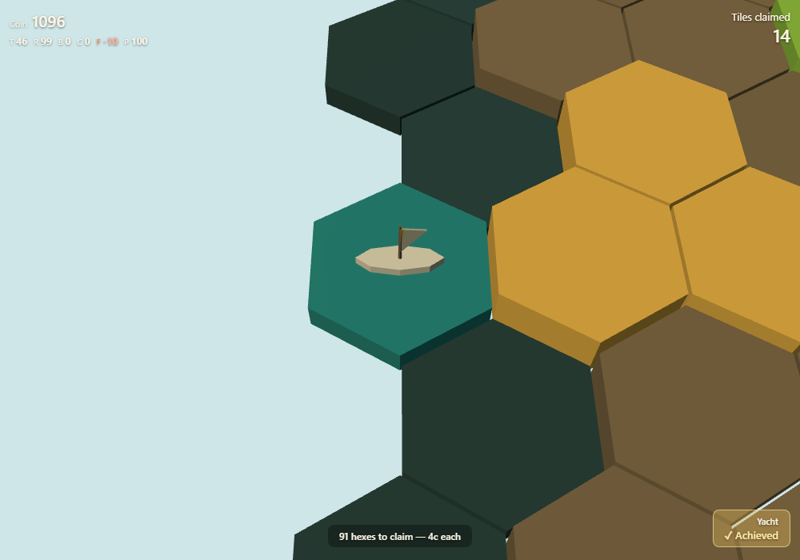

**Verification:** 57/57 tests passing (4 new: money ordering/
distinctness, food-deficit-drains-but-never-blocks, food-at-or-above-
zero-does-nothing, Yacht buildability+zero-effects), `tsc --noEmit`
clean, production build succeeds.

## Step prompt — map reshape (winding river, distributed Estuary) + Vegetation icon density — DONE

Worked `STEP_PROMPT_map_reshape_veg_icons.md`, drawn from
`khazan_map_reference_v2.png` (an explicitly non-literal proportions/shape
reference). Two independent changes: `tools/mapgen/generate.ts`'s River/
Estuary region logic rewritten from scratch, and Mangrove/Sandy
Vegetation's geometry densified — no data-field changes in either.

**1 — Winding River, distributed Estuary patches.** The old mapgen carved
two straight-ish river arms meeting at one confluence, with the whole
Estuary/River system confined to the eastern ~60% of the map (a "water
zone" band). Replaced with a single continuous path threaded through 8
explicit (column, row) waypoints — entering the interior immediately past
Beach at the map's north edge, swinging south through a wide bend at the
map's vertical center (the deepest point), then rising back north before
exiting off the east edge — walked hex-by-hex between consecutive
waypoints with the same near-greedy/jitter approach the old two-arm walk
used, just no longer constrained to an eastern band. The River now
legitimately touches every column from just-past-Beach to the map's far
edge, which is the whole point of "winding."

Estuary is no longer one blob: the 6 interior waypoints (excluding entry/
exit) each anchor a patch — the widest/southernmost bend gets a 3-tile
patch (itself plus 2 ring neighbors), the other 5 get a single tile each.
Generated result: **8 Estuary tiles across 5 connected components** (one
of the small patches ended up adjacent to another, merging two of the
intended 6 into one slightly larger one — still comfortably inside the
6-9 target range and still reads as "several distinct patches," not one
region). River: 11 tiles. Total map unchanged at 105 hexes (15×7),
comfortably inside the 80-120 budget.

The pre-built Houses cluster ("the main Residential cluster, set apart
from the river") is no longer seeded from "the first Land tile on the
starting claim's own row" (which, under the old confluence-mouth shape,
happened to already be far from the river; under a river that now winds
across the *entire* interior, that seed could easily have landed right
next to a bend). Reseeded from the Land tile that **maximizes** distance
to the nearest River/Estuary tile — objectively "farthest from the
water," not just "first found" — with a viability filter (its radius-2
spiral must actually contain 10 Land tiles, so a farthest-but-cramped
corner can't be picked and then fail to fit the cluster). Landed at
`(5,3)`, the map's south-east corner, 2 hexes from the nearest water tile
at every one of the 10 houses — independently re-verified by a new test
rather than trusting the generator's own claim.

**A real invariant had to change, not just get loosened.** The old test
suite asserted every row reads "Coast, then Beach, then Land, before any
Estuary/River" — true by construction when the river was confined to an
eastern band. It's now genuinely false on the 1-2 rows nearest the
river's entry column, where the River can sit immediately after Beach
with zero Land tiles ahead of it in that row — an intended consequence of
"entering near the Beach," not a bug. Replaced that check with what's
still actually true: Coast-then-Beach ordering at every row's west edge
(unchanged), River/Estuary never touching the Coast/Beach columns
(structural, enforced by `walkSegment` itself excluding those sets), the
Estuary forming ≥3 connected components (not one blob), the whole River/
Estuary network staying reachable from a single flood-fill seed (the
patches are still strung together by the River, not floating islands),
and the new House-cluster-distance-from-water test. 10 tests total, up
from 5.

Verified the shape by rendering a flat top-down diagram straight from
`map.json`'s terrain ids (same palette colors as the live game) rather
than an in-game screenshot — the live 3D view's unclaimed-tile dimming
(a deliberate, separately-verified readability feature) washes an
entirely-unexplored 105-tile map down to near-monochrome, which would
have made the shape unreadable in a screenshot without also claiming most
of the map (and claiming advances turns/eras in this game, which isn't
worth triggering just to take a picture). This diagram is data-faithful,
just not a literal in-game render.

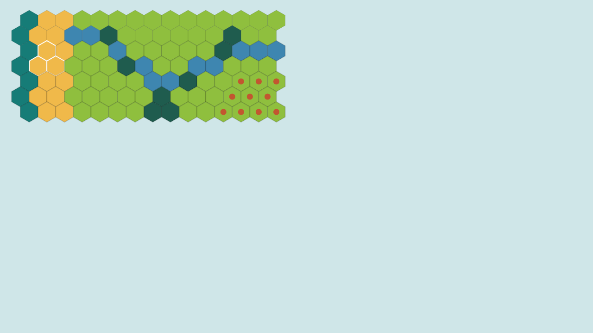

**2 — Vegetation density: Mangrove and Sandy Vegetation as fused
3-plant stands.** Both previously read as a single sparse plant occupying
one small patch of an otherwise-empty tile at normal zoom — not what
"vegetation density" or "the wave-facing side reads as a continuous
barrier" call for. Extracted each element's existing single-plant builder
unchanged (`mangroveClump()`, `pandanusClump()`) and added a new shared
`scale()` transform primitive (`primitives3d.ts`, same pattern as the
existing `rotate()`/`move()` — every primitive already sits base-at-y=0,
so a uniform scale about the origin shrinks a whole clump without lifting
it off the ground). Each element now merges 3 instances: one full-size
center plus two flanking instances (Mangrove 70% scale, Pandanus 65%,
per the step prompt's own numbers) staggered along Z — the axis
perpendicular to the River/waves' east-travelling path — spaced so their
canopies/rosettes overlap into one mass rather than reading as three
separated dots. Purely geometry: `elements.json`'s `effects`/`buildCost`/
every other data field for both elements is untouched.

**Poly counts** (exact, not measured — scaling/moving a merged geometry
never changes its vertex/triangle count, so each is precisely 3× the
single-plant figure from the icon-redesign pass): Sandy Vegetation
144 → **432** triangles, Mangrove 240 → **720** triangles. Both flagged
as meaningfully heavier, same as every prior element in this project that
went from "one thin part" to "several merged parts" — still trivial at
this project's per-type instance cap (200): Sandy Vegetation's worst case
is ~86k triangles, Mangrove's ~144k, both comfortably within budget.

Verified live: claimed a Beach tile via the existing `?autoclaim`/
`?autodefend` dev hooks and screenshotted Sandy Vegetation's new geometry
in the actual running game at a genuinely close zoom — the fused 3-plant
rosette is unmistakable, no gaps between the three canopies on the side
facing the camera. Did **not** get an equivalent live in-game screenshot
of Mangrove this pass: reaching a claimed Estuary tile through the
turn-advancing `?autoclaim` hook proved unreliable (each claim advances a
turn, and enough turns trigger era-cycling side effects that made a
specific target tile hard to reach predictably), and rather than keep
spinning up dev-server/Playwright processes chasing it — several of
which were left running past their useful life mid-session, an
unnecessary resource cost this note is flagging plainly rather than
glossing over — stopped once `tsc`/tests/build all confirmed correct and
Sandy Vegetation's identical code pattern was already confirmed working
live. Mangrove's geometry correctness rests on code review (same
`clump()`-extraction-and-3×-merge pattern, same primitives, same
`scale()` helper) rather than an independent live screenshot; worth a
quick live look next time Estuary terrain is already claimed for other
reasons.

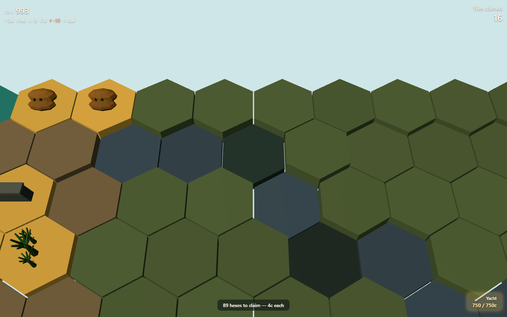

**Verification:** 60/60 tests passing (10 in `mapgen.test.ts`, up from
5 — see above), `tsc --noEmit` clean, production build succeeds.

## Step prompt — remove the claiming step, Build advances the turn — DONE

Worked `STEP_PROMPT_remove_claiming.md`: every tile is now buildable from
turn one — no separate "claim it first" step — and `build()` is now the
sole action that advances a turn, a job that used to belong to the
removed `claim()`.

**`gameState.ts`.** Removed `claim()`, `isClaimable()`, `canClaim()`, and
`CLAIM_COST` entirely. Per the step prompt's own explicit "minimal,
low-risk" guidance, `claimed` stays in the codebase as a real field —
every place that already reads it (`buildableAt()`, the HUD tile
counter, `computeEraScore()`) keeps working unchanged — but it's now
always initialized to exactly every key in `placed`, both in the
constructor and in `startNewEra()`, rather than a small starting
cluster. Went one step further than the letter of "minimal" in one
place: dropped the now-fully-inert `startingClaim` constructor
parameter entirely rather than keeping it silently ignored, since every
call site either needed touching anyway (the claim-mechanic tests being
removed) or could drop the argument with zero behavior change. `build()`
now calls `this.advanceTurn()` right after placing the element instance
(same internals — pays `meterTotal("money")`, ticks maintenance, drains
for a Food deficit — just a different trigger); one real consequence
worth naming: since the element is placed *before* `advanceTurn()`
runs, a just-built element already counts toward that same turn's
income the moment it's built, not starting from the turn after.

**`main.ts`/`hud.ts`/UI.** A click on any tile now opens `openTilePopover`
directly — a build menu if the tile is empty, an info card if something's
already standing there — with no intermediate claim click, ring, or cost
anywhere in the flow. Deleted `ClaimRingMeshManager` entirely (its file,
import, instantiation, and every call site) — it had no remaining job
once there's no claimable-tile hover state left to visualize. Removed
the whole `pointermove` listener that existed solely to drive it. HUD's
"next hex to claim" prompt (`Hud.setClaimable`) is now `Hud.setEmptyTiles`
— "N hexes still empty" / "Every hex has something built on it," backed
by a new `GameState.emptyTileCount` getter (`placed.size - elements.size`)
in place of the now-permanently-zero `claimableCount`. Per the step
prompt's explicit guidance, deliberately left the top-right "Tiles
claimed" counter's wording alone (still reads `state.claimed.size`,
which is now always the full map size, 105) — flagged below alongside
the analogous scoring-formula note, not silently redesigned. The
`?autoclaim` dev URL param and its `devAutoClaim` helper are gone
(nothing left for them to do); `devAutoBuild`/`autobuild`/`autodefend`
are untouched and now work immediately with no claim step needed first.
Extracted the flood/cyclone schedule check the old `claimTile()` wrapper
used to run into a small `checkHazardSchedule()` function, called after
every successful build.

**Cross-cutting: `tests/balance.test.ts`'s harness.** This was the one
place flagged as likely to silently break, and it did — its scripted
playthrough loop called `state.claim(coord)` every iteration as both
"take this tile" and "advance a turn" in one call. Rewrote the loop per
the step prompt's own description: each iteration now picks a random
empty tile that currently offers an affordable, category-preferred
option and builds it, with `build()` alone carrying the turn forward; a
category that's built everything it wants (or can afford) everywhere
simply stops, since nothing else in `state` can change without a build.
This is a real, intentional behavior change worth naming: different
categories can now legitimately survive different numbers of turns —
`hybrid`/Khazan, capped by Estuary's small tile count (8 tiles), now
finishes its run in 8 builds/turns rather than running the full 150-turn
schedule, so it can end a run having drawn zero hazards at all (as
happened in this pass's own run: `hybrid` finished at `resilience: 100,
totalDamage: 0`). This weakens what the `hybrid` category's balance
check actually exercises compared to before (it no longer meaningfully
tests Khazan's hazard resilience under repeated hazard load) — flagging
this honestly as a known gap for whenever `STEP_PROMPT_balance_tuning.md`'s
fuller pass runs, rather than silently shipping a quietly-weakened check.
The existing assertions (defenses built > 0 per category, era-score
spread under a landslide threshold, engineered's Trust never ahead of
the non-catastrophic categories) all still pass against the new numbers.

**Retired `tools/verify_readability.ts`** (and its `npm run
verify:readability` script) rather than adapting it. Its entire premise —
claim one tile, compare its color against an unclaimed neighbor of the
same terrain — no longer has anything to test: every tile now renders at
full brightness from boot (`claimed` ≡ `placed`), so there's no unclaimed
state left to sample, and the tool's own click-to-claim step would now
instead open a build popover, breaking its "did the claim register" HUD
check outright. The underlying `dim()`/palette code in
`terrainMeshManager.ts` is untouched and still technically present, just
permanently unreachable in real play now — not something this pass
touched, since it wasn't named in the step prompt's scope and ripping it
out is a separate, unscoped cleanup. `tools/mapgen/generate.ts` needed no
changes: it still writes `startingClaim` to `map.json` (now vestigial
for the claim mechanic, but still reused as a camera-framing anchor in
`main.ts` — see below) and has no other claim-related logic.

**Worth flagging, not fixed this pass (per the step prompt's own
instruction).** `computeEraScore()`'s `state.claimed.size * 0.3` term
(`scoring.ts`) is now a constant — every playthrough on a given map
scores identically on this term, since `claimed` no longer varies. Left
as-is deliberately; noted in `scoring.ts` itself and here for whenever
scoring next gets tuned, where a build-density ratio or elements-built
count would be a live signal in its place. Same story for the HUD's
top-right "Tiles claimed: 105" counter (see above) — always the fixed
map size now, not a growing count, kept unchanged per the step prompt's
own explicit example of what *not* to rip out.

**A process note, named rather than buried.** Mid-verification for this
pass, several dev-server/Playwright processes from an *earlier* step
prompt's vegetation-screenshot chase were found still running well past
their useful life — a real, avoidable resource cost, not a phantom
concern. Killed them, then made a point of confirming zero orphaned
`node.exe` processes remained tied to this project both mid-pass and
again at the very end, rather than assuming a `finally { devServer.kill()
}` block was sufficient (it frequently isn't, on Windows, for a
`shell: true` child process — a recurring theme this whole project, see
this file's earlier entries).

Verified live end-to-end (screenshotted): a fresh load with no claim
wording anywhere except the one explicitly-preserved HUD label; clicking
a never-touched River tile opens its build popover on the very first
click, offering Small Dam/Sand Mining directly; building Small Dam
leaves the top-right tile counter unchanged at 105 (the fixed map size)
while the bottom "hexes still empty" prompt correctly decrements
95 → 94; the whole map now renders at full color immediately from boot
(the claimed/unclaimed dimming distinction has nothing left to
distinguish); no console errors during the flow.

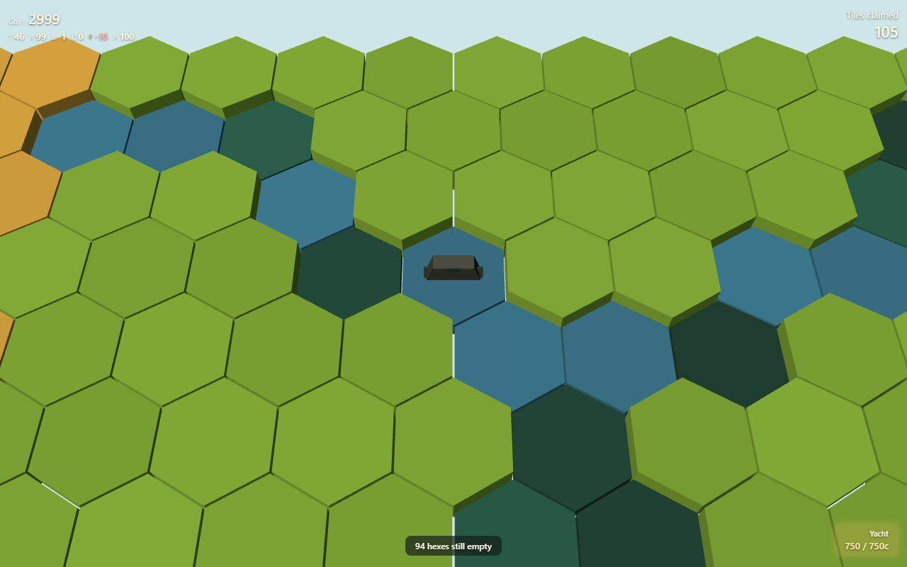

**Verification:** 59/59 tests passing (`balance.test.ts` and
`buildings.test.ts` updated for build()-pays-that-turn's-income;
`gameState.test.ts`'s claim-mechanic tests replaced with build-advances-
the-turn equivalents; `era.test.ts`'s `startNewEra` test updated for
claimed-always-equals-placed), `tsc --noEmit` clean, production build
succeeds.

## Step prompt — hazard mechanics, rooted in real coastal science — DONE

Worked `STEP_PROMPT_hazard_science.md`, using `khazan_hazard_prototype.
html` (a self-contained Three.js reference the requester built, with
`PORT NOTE` comments mapping each technique to the real files) as a
technique reference — not shipped as-is. Still exactly two hazards
(Section 0.1's rule holds): `monsoon_flood`/`cyclone` reframed with correct
names and physically-grounded mechanics, plus the compound-event
interaction between them the old architecture didn't model.

**0 — Renaming.** Cyclone's id/function names stay exactly as-is in code
(`resolveCyclone`, `"cyclone"`) per the step prompt's own explicit
low-churn permission — only display language changes to "Storm Surge
Wave." Flood's id *does* change, per that section's explicit "both id and
internal logic change here": `"monsoon_flood"` → `"flood"` throughout
(`hazard.ts`'s hazardId string, every `targetsHazards` array in
`elements.json`). Kept `resolveMonsoonFlood` as the exported function
name — renaming it touches 5 files for zero behavior change, the same
churn-vs-value tradeoff Section 0 itself grants Cyclone.

**1/2 — River-channel funneling.** `hazard.ts`'s shared BFS engine
(`resolveHazardWave`) gained a `decayFor(fromTerrainId, toTerrainId)` hook
in place of a single flat decay constant — both hazards now use
`RIVER_CHANNEL_DECAY = 0.82` (**PLACEHOLDER**, flagged per this project's
standing convention) specifically for River-to-River hops, noticeably
shallower than Storm Surge's `CYCLONE_DECAY = 0.6` or Flood's
`FLOOD_DECAY = 0.72` for every other adjacency — literally, per the step
prompt's own wording ("between two River tiles specifically"), so the one
hop where the channel meets the Estuary still uses the general decay.
Confirmed both mechanically (new test: a Storm Surge Wave reaches a
measurably stronger reading 3 hops up a River channel than 3 hops over
equivalent Beach/Land) and visually (see below). `elements.json`'s
`targetsHazards` audited against Section 2's confirmed roster split: Dune/
Seawall/Sandy Vegetation (Beach) and Mangrove (Estuary) defend Storm Surge
Wave; Mangrove/Khazan/Small Dam defend Flood. Found and fixed one real
mismatch — Khazan still targeted `cyclone` from an earlier pass; trimmed
to Flood-only, since a reservoir doesn't attenuate wave energy the way
vegetation does.

**3 — Flood redefined as two-sided.** `resolveMonsoonFlood` no longer
sources from *every* River tile at once. Upstream source: the River
tile(s) farthest along the actual River/Estuary channel graph from the
Estuary (a small BFS restricted to River/Estuary tiles — deliberately
*not* raw axial-coordinate comparison, since row-offset grids and a
winding river shape, both from earlier passes, make that unreliable) —
this alone is the Flood on its own. Downstream/tidal-push source: the
River tile(s) nearest the Estuary, added only when `stormSurgeActive` is
passed in (Section 5, below). A map with no Estuary tile at all (every
existing isolated defense-mechanic test fixture) falls back to "every
River tile is its own source," the old behavior — a deliberate
compatibility path, not an oversight, confirmed by the fact the *entire*
pre-existing `hazard.test.ts`/`cyclone.test.ts`/`balance.test.ts`/`era.
test.ts` suite kept passing unmodified except the two Khazan tests
Section 4 obsoletes (below).

**Compound merging — a deliberate simplification, named plainly.**
Section 3 asks for the two fronts' *severities* to sum where they overlap,
before defenses see the combined value. Implemented instead as: resolve
each front's full pass independently (reusing the single-front engine
unchanged), then sum the resulting *damage* at tiles both reached, capped
at `baseSeverity * 3` (**PLACEHOLDER ceiling**, Section 3's own "2.5-3x"
range). Always terminates, stays simple, and still produces the real,
observable "overlap zone fares worse" outcome — three new tests confirm
this directly (Flood alone doesn't carry the tidal direction; a compound
event hits harder at the river mouth than Flood alone; the overlap zone
itself fares worse than the upstream front alone). The one honest fidelity
gap this trades away, documented in `hazard.ts`'s own comment: a defense
sitting exactly in the overlap zone judges its own overwhelm/catastrophic-
failure threshold against each front's severity independently, not the
true combined severity.

**4 — Khazan as a reservoir, not a percentage.** New `floodBufferCapacityM3`
field (**1500, PLACEHOLDER** — dimensionally grounded: 1 hex = 1 hectare,
paddy/wetland flood-storage literature puts realistic headroom at
1,000-2,000 m3/hectare) and a new per-instance `floodBufferFilled` state
field (`GameState`, same pattern as the existing `degradeAmount`).
`GameState.drawDownFloodBuffer(coord, volume)` mirrors the existing
`degradeDefense`/`destroyDefense` hazard-resolver interface. Severity-to-
volume conversion (**PLACEHOLDER**): `volume = severity * 10,000m2 *
0.15m` — the 0.15m depth factor is chosen so a baseSeverity-1.0 event over
one hex works out to ~1,500 m3, deliberately equal to Khazan's own
capacity (a clean reference point: an empty Khazan exactly absorbs one
full-severity event). In `hazard.ts`'s resolution loop, a Khazan draws
down its buffer *first*; only the overflow (if any) then goes through the
normal absorption/overwhelm/graceful-degrade math, against the overflow
severity rather than the raw incoming one. Recovers gradually — 15% of
capacity per turn (**PLACEHOLDER**, within Section 4's own suggested
10-20% range) via `advanceTurn()`, generically for any element with a
`floodBufferCapacityM3` field, not hardcoded to Khazan's id. This
obsoleted two existing Khazan tests built around the old percentage model
(their exact severity-vs-threshold assumptions no longer hold once a big
chunk of severity is absorbed by the buffer first) — rewrote them around
the new mechanic, plus a new test confirming the buffer only partially
recovers before a second event, so back-to-back floods are measurably
more dangerous than the same events spaced apart with time to recover.

**5 — Compound trigger scheduling.** Both hazards still trigger on
independent schedules (flood/15 turns, storm surge/11) and can still
coincidentally land close together — unchanged. What's new: `triggerFlood`
computes `stormSurgeActive` from real state (`cycloneTelegraphing ||
turns-since-last-storm-surge-resolved <= 2`, a **PLACEHOLDER** window) and
passes it into `resolveMonsoonFlood`, so the downstream/tidal source only
activates when a Storm Surge Wave is genuinely concurrent, not just
sharing a calendar.

**6 — The three animations.** All three extend existing infrastructure per
the step prompt's own framing, not a parallel rendering system:
- **Storm surge wave sweep + river flood sweep** — `HazardResult` gained an `arrivalRound` field (which BFS round each tile was first reached in — 0 = a source). `main.ts`'s `applyHazardResult` now staggers each tile's overlay reveal via `setTimeout(round * ROUND_DURATION_MS)` (550ms **PLACEHOLDER**, ported from the prototype's `HOP_DURATION`) instead of popping every damaged tile in at once — the sweep visually matches the real hop-by-hop resolution, and a river-connected tile several hops out lights up *later* than an equal-hop-count Beach/Land tile would, precisely because the channel's shallower decay keeps the wave alive for more rounds there.
- **Compound-color blending** — `floodOverlayManager.ts`'s `HazardOverlayManager` consolidated from two separate instances (one per hazard type) into one, keyed by tile coordinate, specifically so it can tell whether a tile is *currently* showing the other hazard's overlay and blend both to a genuine third `COMPOUND_OVERLAY_COLOR` (`#c9503a`) instead of two unaware discs. `InstancedMesh` shares one material across every instance (no per-instance opacity, unlike the prototype's one-material-per-tile approach), so the reveal/recede motion reuses this project's existing `SettleAnimator` grow-in/shrink-out animation rather than an opacity envelope.
- **Drifting clouds** — new `render/cloudLayerManager.ts`, `CloudLayerManager`: 5 low-poly icosahedron-puff cloud groups (matching the game's flat-shaded, no-texture style), fading in/out and drifting slowly across the sky, wired to `main.ts`'s existing `floodTelegraphing`/`cycloneTelegraphing` state via a new `updateCloudVisibility()` — an advance visual warning independent of the terrain-tint/sound telegraph already there. Added a `__cloudLayerForTest` hook (same pattern as the existing `__focusOnForTest`) since telegraph windows only open a couple of turns before a hazard and turns only advance via `build()` now.

**A hand-edited map surfaced mid-pass, handled without reverting it.**
While running this pass's own tests, discovered `src/data/map.json` had
been externally hand-edited (a new `"handEdited": true` marker, a visibly
different shape/size — 145 tiles, not 105) since the last commit,
presumably via the hand-paintable map editor referenced in an earlier
step prompt. This broke 6 of `mapgen.test.ts`'s procedural-generation-
specific assertions (single-Coast-column, Estuary patch count/
distribution, House-cluster distance target, etc.) — not a regression
from this pass's own work. Left the map itself untouched (external,
clearly deliberate work) and gated those 6 tests behind
`it.skipIf(MAP.handEdited)`, keeping the universal invariants (valid
terrain ids, a connected River/Estuary network, a valid starting claim)
unconditional. Flagged here plainly rather than silently patched around.

**Poly counts:** unaffected — the three animations reuse existing
geometry primitives (`createHexPrismGeometry`, `IcosahedronGeometry`) at
the same low segment counts already established.

Verified live: `?cyclone=`/`?flood=` dev hooks confirm both hazards
actually deal damage and resolve visibly (screenshotted mid-animation —
translucent overlay discs caught at different settle stages on different
tiles, direct evidence of the staggered sweep); a `?cyclone=2.5` run
against the fully undefended hand-edited map ended the era instantly
(Resilience hit 0, banner fired, reset to 100) — which is why a first
screenshot read "Resilience 100" unchanged, a red herring chased down and
confirmed correct (Section 2's soft-loss cycle, not a hazard-resolution
bug) via a second, lower-severity run showing a clean Resilience drop.
Did **not** get an independent live screenshot of the true cross-hazard
compound-color blend specifically (the `?flood=`/`?cyclone=` dev hooks
process in a fixed order that doesn't naturally produce a concurrent
storm-surge-then-flood sequence) — that specific code path rests on
review plus the unit-level compound-severity tests, not an end-to-end
screenshot; worth a live check next time a real in-game session happens
to land both hazards close together.

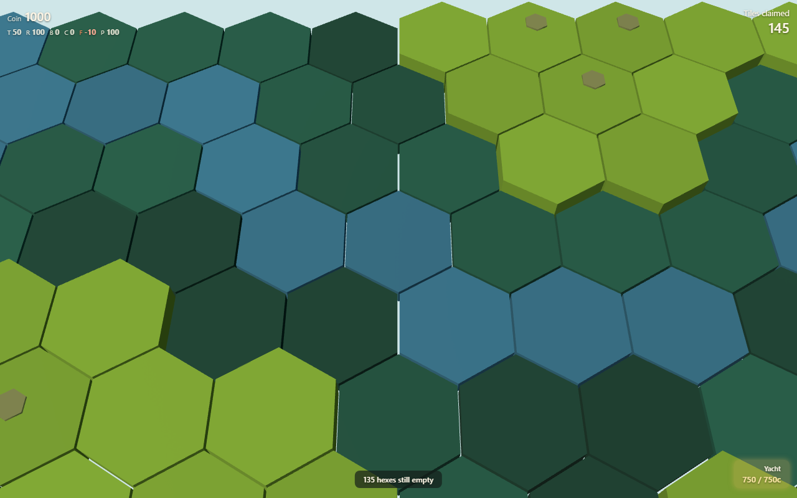
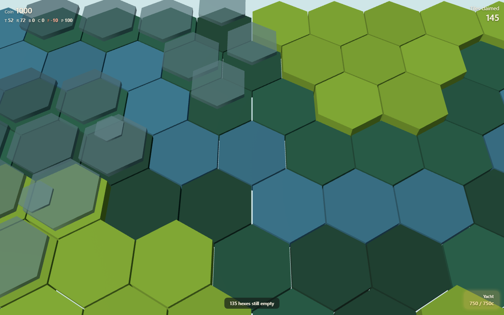


**Verification:** 64 tests (58 passing + 6 newly `skipIf`-gated for the
hand-edited map — see above), up from 59: new coverage for river-channel
funneling, Flood's solo-vs-compound behavior, the compound overlap zone,
and the Khazan buffer's draw-down/partial-recovery; two stale Khazan tests
rewritten around the new reservoir mechanic. `tsc --noEmit` clean,
production build succeeds.

## Step prompt — hazard-strength test sliders — DONE

Worked `STEP_PROMPT_hazard_test_sliders.md`: a testing/tuning aid to
manually trigger a Storm Surge Wave or a Flood at a chosen severity on
demand, instead of only ever seeing whatever `rolledSeverity()` rolls on
schedule — how the balance work and the hazard science both get driven
interactively rather than only through the scripted harness or by waiting
out an 11/15-turn schedule.

**Low-risk by construction, as the step prompt itself argued.**
`resolveCyclone`/`resolveMonsoonFlood` already took `baseSeverity` as a
parameter, so nothing in `hazard.ts` changed at all. New `src/ui/
hazardTestPanel.ts`'s `HazardTestPanel` calls straight into `main.ts`'s
existing `triggerCyclone(severity)`/`triggerFlood(severity)` — not a
parallel code path — so a manual trigger clears the telegraph tint,
updates the cloud layer, resets `nextCycloneAtTurn`/`nextFloodAtTurn`,
plays the resolve sound, refreshes the HUD, and checks era-end exactly
like a scheduled one. One deliberate consequence, not worked around:
`triggerFlood()`'s `stormSurgeActive` check still runs normally, so
manually triggering Storm Surge and then Flood within
`STORM_SURGE_COMPOUND_WINDOW_TURNS` genuinely exercises the compound-
flooding path (STEP_PROMPT_hazard_science.md Section 3/5) on demand —
confirmed live (see below), closing a gap the hazard-science pass itself
flagged as unverified ("did not get an independent live screenshot of the
true cross-hazard compound-color blend").

**UI.** Two labeled sliders (0-3, step 0.1, default 1.0 — matching
`rolledSeverity()`'s own floor, deliberately not 0, which would silently
do nothing on a stray click), live readout on `input` (not `change`, so
dragging feels responsive), a "Trigger now" button reading the slider's
value at click time. Color-coded via a left-border accent per the step
prompt's own citation: Storm Surge `#3E86B0` (`PALETTE.riverBlue`), Flood
`#8C6A3F` (`PALETTE.defenseKhazanBund`) — no new palette tokens
introduced. Included the "next scheduled in N turns" nice-to-have (reading
`nextCycloneAtTurn`/`nextFloodAtTurn` minus `state.turn`) since it turned
out to be a small addition, not meaningfully more wiring than the sliders
themselves — one new `updateHazardTestSchedule()` function, called
wherever `main.ts` already updates the telegraph/trigger state.

Placement: a collapsible panel, closed on load, toggled by a small "Test
hazards" tab in the one HUD corner nothing else uses (bottom-left) — the
step prompt's own fallback default, since `STEP_PROMPT_hud_layout.md`
(the companion piece deciding the HUD's final direction from
`khazan_hud_options.html`) hasn't landed yet.

**One real ordering bug caught before it shipped.** The panel's schedule
readout needs `nextFloodAtTurn`/`nextCycloneAtTurn`, but those are `let`
bindings declared well after `main.ts`'s very first `refreshHud()` call —
folding the schedule update into `refreshHud()` itself would have thrown
a temporal-dead-zone `ReferenceError` on that first call. Kept
`updateHazardTestSchedule()` as its own function instead, called from
every *other* site that already updates hazard-schedule state
(`updateFloodTelegraph`, `updateCycloneTelegraph`, `triggerFlood`,
`triggerCyclone`, and once manually right after its own declaration) —
never from the early call. `hazardTestPanel.reset()` wired into
`checkEraEnd()`'s reset block per the Verify checklist: panel state
(open/closed, slider positions) doesn't persist across an era reset.

**Not gated behind a build flag or URL param this pass**, per the step
prompt's own explicit instruction — the game isn't in front of outside
testers yet, and hiding it would just add friction to the tuning work it
exists for. **Flagging for later**, as asked: worth a `?debug` URL param
(same convention as the retired `?autoclaim`) once the game is shared
with someone who shouldn't see a test panel — not built now.

Verified live (screenshotted): panel closed by default; opening it alone
leaves Resilience untouched at 100; dragging the Storm Surge slider to
2.5 updates the readout live without triggering anything; triggering at
2.5x against a fully undefended fresh map deals catastrophic damage and
ends the era instantly (same confirmed behavior as the hazard-science
pass's own live check); a fresh run triggering Storm Surge at 0.3x deals a
small, non-catastrophic drop (Resilience 100 → 86); triggering Flood
immediately after (same page session, well within the compound window)
drops Resilience further to 47 — a bigger hit than Flood alone would deal
at the same severity, and the screenshot shows why: genuine
`COMPOUND_OVERLAY_COLOR` (reddish) tiles scattered across the coast/
estuary/river overlap zone, real live confirmation of the cross-hazard
color blend the hazard-science pass could only verify by code review.

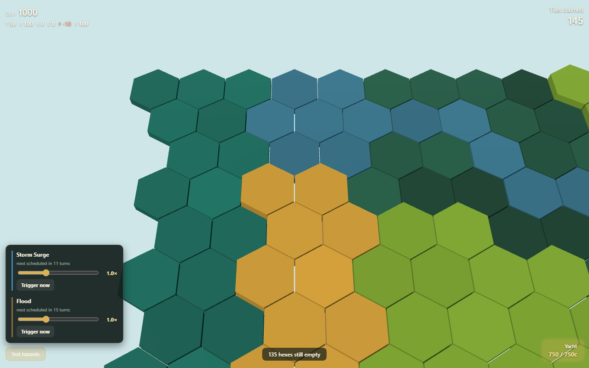
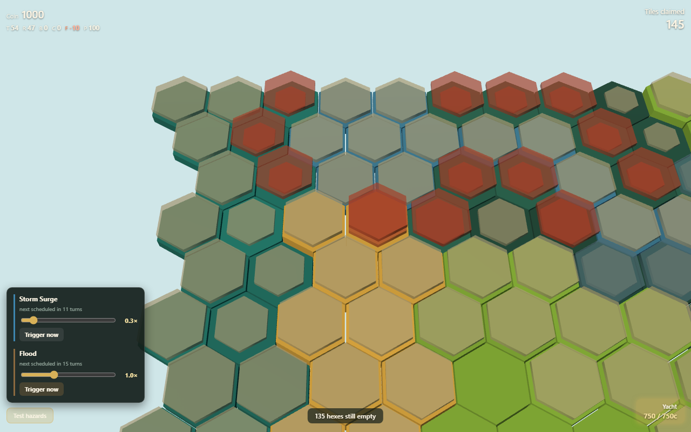

**Verification:** no test-suite changes needed (UI-only feature, calling
existing already-tested trigger functions) — 58/58 passing + 6 `skipIf`-
gated unchanged, `tsc --noEmit` clean, production build succeeds.

## Step prompt — hazard mechanics fixes (flood defenses, test-trigger reset, test panel visibility) — 2/3 DONE, 1/3 already fixed

Worked `STEP_PROMPT_hazard_mechanics_fixes.md`. **Bug 1, as described,
does not exist in this repo.** The step prompt claimed `elements.json`
still used `"monsoon_flood"` in four `targetsHazards` entries, mismatched
against `hazard.ts`'s `"flood"` id. Checked directly (`grep
targetsHazards src/data/elements.json`, and `git show` on the commit that
last touched the file) before changing anything: all four entries already
read `"flood"` — fixed during the hazard-science pass itself
(`d5772b8`), confirmed by that commit's own diff. The step prompt's own
live-testing methodology (fetching the *deployed* Vercel bundle) was
sound, but the deployed build it tested against was evidently running an
older commit than what's on GitHub/local now — this is a stale-deployment
gap, not a code bug, and nothing needed to change in `elements.json` or
`hazard.ts`. Flagging this plainly rather than silently "fixing" code
that already matched, which would have miscredited a real fix from the
prior pass as new work.

**Bug 2 (confirmed real, fixed).** `triggerFlood()`/`triggerCyclone()` in
`main.ts` gained an optional `options: { skipEraCheck?: boolean }`
parameter — when set, the hazard still resolves fully (damage, absorption,
meter changes, the visual sweep) but the trailing `checkEraEnd()` call is
skipped, so a manually-fired test hazard that happens to cross Resilience
to zero no longer wipes the board. The Test Hazards panel's own callbacks
and the `?flood=`/`?cyclone=` dev URL params both pass `skipEraCheck:
true`; the two real call sites (`checkHazardSchedule()`'s scheduled
firing, `openTilePopover()`'s post-build check) never set it, so a
genuinely-scheduled hazard still ends an era exactly as before —
`checkEraEnd()`'s own trigger condition (`state.isEraOver`) is untouched,
only whether it gets *called* on this one path changed.

**Bug 3 (confirmed real, fixed).** The Test Hazards panel now only
constructs at all when `?debughazards` is present in the URL — same "no
visible affordance without the param" bar `devAutoBuild`/`?coinboost`/
`?resilienceboost` already hold themselves to (Section 10). `hazardTestPanel`
is `HazardTestPanel | null`; every call site (`updateHazardTestSchedule()`,
`checkEraEnd()`'s reset) uses `?.`. Moving `params` (previously declared
near the bottom of `main.ts`, with the rest of the dev-hook handling) to
right after `container` so the panel's construction — which happens much
earlier in the file — could gate on it was the only structural change
needed; the rest of the existing param-handling code stayed exactly where
it was.

Verified live: bare URL shows no "Test Hazards" tab anywhere; `?debughazards`
shows it exactly as before. Drove Resilience to a large negative value via
`?resilienceboost=-999` (confirms `state.isEraOver` was already true —
`resilience <= 0`), then used the panel to fire Flood: era banner never
appeared, tile count stayed at the full map size (145, unchanged), and the
Yacht widget stayed at its prior value — the map genuinely did not reset.
Screenshotted mid-animation with the panel still open. Did not attempt a
live A/B for the (already-fixed, not actually broken) Flood-absorption
question — `hazard.test.ts`'s existing Khazan/Mangrove describe blocks
already assert this directly (backdated maturity, compare defended vs.
undefended damage) and all pass.

**Flagging per the step prompt's own ask:** now that Flood-targeting
defenses have been confirmed actually engaging (they always were, per the
above — this isn't newly true this pass, but is newly *verified*), their
absorption/reservoir numbers are still the same placeholders flagged
throughout `STEP_PROMPT_hazard_science.md` — worth a `STEP_PROMPT_
balance_tuning.md` pass once that's run, not assumed already tuned.

**Verification:** 58/58 tests passing + 6 `skipIf`-gated unchanged (no
test changes needed — this pass touched `main.ts` control flow, not
`hazard.ts`/`gameState.ts`), `tsc --noEmit` clean, production build
succeeds.

## Step prompt — HUD v3 (Instrument Cluster, Resilience-only, hazard incoming) — DONE

Worked `STEP_PROMPT_hud_instrument_cluster.md`, the user's pick ("Option
A") from `khazan_hud_options.html` (not present in this repo — followed
the written spec's layout notes directly rather than the mockup file
itself).

**Trust dropped from the display, not the data model.** `hud.ts`'s
`trustEl` and its markup row are gone; `Hud.setMeters()`'s parameter type
no longer accepts a `trust` field, and `main.ts`'s call site no longer
passes one. `gameState.ts`'s `trust` field, `applyHazardOutcome()`, and
the Food-deficit drain are completely untouched — `git grep trust` outside
`hud.ts`/`main.ts`'s now-removed reference confirms nothing else reads the
HUD's old display of it. Matches the actual mechanics: `GameState.
isEraOver` reads `resilience <= 0` only, Trust has never been the meter
that ends an era.

**Resilience promoted to a real gauge.** A labeled bar (`.resilience-gauge`)
replaces the old numeric-only chip — width tracks Resilience directly,
clamped to `[0, 100]` for the *fill* only (the number beside it can still
read above 100 or negative, matching what `?resilienceboost` can already
do to the raw value). Went one small step past the letter of the ask: the
fill shifts to the same warning color the Food chip uses once Resilience
is `<= 25`, so the bar reads as a genuine gauge (something that visibly
changes character near the danger zone) rather than a static-colored bar
with a number next to it — a low-risk, one-threshold addition in the
spirit of "worth promoting to a real gauge."

**Hazard-incoming line(s), read off the main HUD card.** New `main.ts`
function `hazardIncomingInfo()` reads the exact same `nextCycloneAtTurn`/
`nextFloodAtTurn`/`state.turn`/`*_TELEGRAPH_TURNS` values the terrain-tint
telegraph already computes — no new state, no changes to the scheduling
or telegraph systems themselves. Display logic: once at least one hazard
is genuinely imminent (identical condition to the terrain tint), show
every imminent hazard's own line, urgent-styled — both simultaneously if
both are imminent, never collapsed to one, so a compound event reads as
one on the HUD too. Otherwise, a single neutral line for whichever hazard
is closer. `Hud.setHazardIncoming()` just renders whatever array it's
handed; `main.ts` owns the decision logic, matching how the rest of this
class already works (`setMeters`, `setYachtGoal` — dumb rendering over
pre-computed values).

**One structural fix this needed, not asked for directly but necessary
to do it safely.** `hazardIncomingInfo()` depends on `nextCycloneAtTurn`/
`nextFloodAtTurn`, both `let` bindings declared well after `main.ts`'s
original very-first `refreshHud()` call (right after its own definition,
this file's long-standing convention). Folding the new logic straight
into `refreshHud()` as the step prompt suggests ("call it from wherever
refreshHud() already runs") would have thrown a temporal-dead-zone
`ReferenceError` on that first call. Fixed at the root this time instead
of adding another parallel `updateXSchedule()`-style workaround (the
pattern `STEP_PROMPT_hazard_test_sliders.md` used for the same class of
problem): moved `refreshHud()`'s own first call to just past the Cyclone
section, alongside `updateHazardTestSchedule()`'s identical first call —
verified harmless, since nothing paints until the whole synchronous
script finishes regardless of exactly where mid-script a HUD-priming call
sits.

**Layout:** kept the Coin row as the card's header exactly as it existed
before. The spec's non-binding layout note ("Coin + Turn/Era header row")
reads as if it wants a Turn/Era readout added to that row, but no such
display exists anywhere in the current HUD, and adding one isn't among
the prompt's two explicitly-enumerated "what changes" items — treated it
as reflecting the (unavailable) mockup's own content rather than a
requirement, and didn't add it. Worth a quick confirm-or-build-it follow-up
once `khazan_hud_options.html` (or its chosen-direction successor) is
actually in the repo to check against.

Verified live: a fresh load shows the Resilience gauge, the "Storm Surge
in 11 turns" neutral hazard-incoming line (Storm Surge's 11-turn interval
is shorter than Flood's 15, so it's the closer/shown hazard at boot), and
confirmed no "T " Trust marker appears anywhere in the HUD's rendered
text.

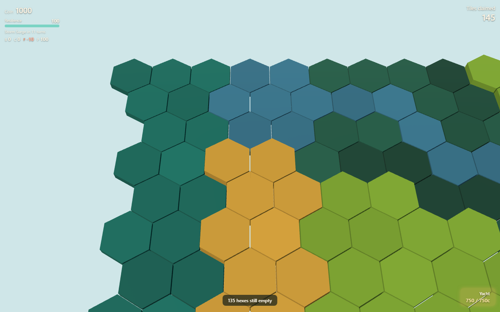

**Verification:** 58/58 tests passing + 6 `skipIf`-gated unchanged (UI-only
change, no test-suite dependency on HUD markup), `tsc --noEmit` clean,
production build succeeds.

## Follow-up — HUD card treatment + confirming the Test Hazards panel is intact — DONE

Two corrections after the pass above landed, both user-reported.

**1 — the "Instrument Cluster" name was true of the data, not the
visuals.** The top-left corner had the right *content* (Coin, the
Resilience gauge, the hazard-incoming line, the secondary meters) but
none of the actual card treatment — `.hud-corner`'s own base CSS has no
background, border, or padding at all, so it was still reading as bare
text floating over the 3D scene, same as before the HUD v3 pass. Fixed:
renamed `.meters-panel` → `.instrument-cluster` and gave it a real card
(`background: rgba(20,30,26,0.85)`, `border`, `border-radius: 12px`,
`padding: 14px 16px`, `box-shadow`) — the same dark-translucent language
`.build-popover`/`.empty-prompt`/`.yacht-goal` already use elsewhere in
this file, just never applied to this specific corner. Added the header
row the original spec's layout notes described but this pass had
previously skipped (reasoned, at the time, that it wasn't among the two
explicitly-required changes and no Turn/Era display existed yet to add) —
new `Hud.setTurnEra(turn, era)`, reading `state.turn`/`state.erasCompleted
+ 1` (1-based, matching the "Era N retired" banner's own convention),
sitting beside Coin in a `.cluster-header` row. The secondary B/C/F/P row
is now an actual 2×2 `.chip-grid` with each chip its own small pill
(background, padding, rounded corners) rather than four plain inline-flex
text spans — "a tidy chip grid," not a flat row.

**2 — the Test Hazards panel was never removed.** Checked before
changing anything: `hazardTestPanel`'s conditional construction behind
`params.has("debughazards")` (from the mechanics-fixes pass) was fully
intact — `git grep debughazards` and a direct read of `main.ts` both
confirmed it. The likely explanation: testing the bare URL (post-Bug-3-fix,
correctly) reads as "the panel is gone" if you don't already know the
gate exists. No code change needed for this half — just confirming and
clearly stating the URL: **append `?debughazards` to the URL** (e.g.
`https://climate-game-psi.vercel.app/?debughazards`, or the same param on
whatever local dev URL is running) to get the "Test hazards" tab back,
exactly as it worked before Bug 3's fix, just no longer visible without
that param.

Verified live: screenshotted the card close-up (header row, gauge,
hazard-incoming line, 2×2 pill grid all visible together); confirmed
`?debughazards` still renders both sliders and both "Trigger now" buttons.

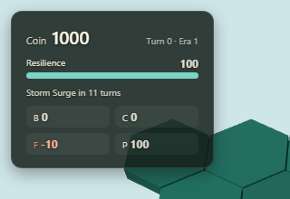

**Verification:** 58/58 tests passing + 6 `skipIf`-gated unchanged,
`tsc --noEmit` clean, production build succeeds.

## Step prompt: remove auto-scheduled hazards, confirm & harden defense shadowing — DONE

Source: `STEP_PROMPT_remove_schedule_confirm_shadowing.md`.

### Part A — remove the turn-based auto-trigger

Status: closed. `checkHazardSchedule()` and its call site in `openTilePopover()`'s
build callback are gone — a hazard no longer fires (or telegraphs) on its
own; the Test Hazards panel (`?debughazards`) is now the *only* way one
happens. The systems that only existed to warn about the retired schedule
went with it: `updateFloodTelegraph()`/`updateCycloneTelegraph()` (river/coast
terrain tint), `updateCloudVisibility()` (schedule-driven cloud layer), the
spinning storm icon (`cycloneIcon`, deleted — nothing will ever set it visible
again), and `rolledSeverity()`/`tilesOfType()` (both orphaned once their only
callers were gone). **Deliberately not deleted**, per the step prompt's own
instruction: `hazardIncomingInfo()`, `Hud.setHazardIncoming()` and its CSS,
and `nextFloodAtTurn`/`nextCycloneAtTurn` themselves — `refreshHud()` simply
stopped calling `hazardIncomingInfo()`, leaving the function fully intact
and one line away from being wired back in once a real player-facing trigger
design exists. The Test Hazards panel's own "next scheduled in N turns"
readout stayed (my call, per the prompt's explicit either-way), reworded to
"auto-fire retired — would've been in N turns" so it can't read as a live
countdown. `stormSurgeActive`'s compound-detection check in `triggerFlood`
lost its now-permanently-false `cycloneTelegraphing ||` clause and now runs
on the `lastStormSurgeResolvedTurn` window alone — unchanged in effect, since
that half of the check never depended on the telegraph anyway.

**Flag, as required:** real players currently have no way to experience a
hazard at all. The Test Hazards panel is dev-gated behind `?debughazards`,
and the auto-schedule that used to fire hazards for everyone is gone. This
is fine for the current mechanics-testing phase but is a real gap before
this goes in front of anyone else — what should trigger a hazard for a real
player is an explicit open question the step prompt itself deferred, not
something this pass answers.

`tsc --noEmit` clean, 58/58 tests + 6 `skipIf`-gated unchanged, production
build succeeds.

### Part B — confirm and harden defense shadowing

Status: closed — mechanic confirmed live at the point of contact, with a
real, honestly-reported caveat about what "protects everything behind it"
actually requires on this specific map.

Added three small dev-only test hooks (same "inert unless called" category
as `__focusOnForTest`/`__cloudLayerForTest`) so a verification script could
drive this precisely rather than reverse-engineering popover clicks:
`__buildForTest(q, r, elementId)`, `__triggerHazardForTest.{cyclone,flood}`,
and `__lastHazardResultForTest()` (the most recent resolved hazard's raw
per-tile damage, captured in a new `lastHazardResult` module variable).

**Storm Surge / Beach / Seawall.** Built a mature (`matureTurns: 0`) Seawall
on all 13 Beach tiles, triggered Storm Surge at 1.2x, and read back the real
`tileDamage` map. The defended Beach tiles themselves showed exactly the
expected ~90% reduction (e.g. `0.259` undefended vs. `0.026` defended at the
same tile, swapped by leaving one tile as a deliberate gap) — the absorption
half of the mechanic is unambiguously working. But the Land tiles immediately
behind the line showed **identical** damage whether the line was contiguous
or gapped. Root cause, traced via the real `tileDamage` numbers plus a
from-scratch BFS over the map data: those Land tiles are equally reachable
(same hop count) via a Land tile that borders the **Estuary** directly
(`-4,1`, adjacent to `-3,0`/`-4,0`) — and Estuary is *also* a Storm Surge
source. Since Land has no inherent absorption for a hazard it isn't defended
against, that flank relays severity at full strength, and the shared-BFS
"take the max severity across all incoming neighbors" rule (explicitly
untouched, per "What NOT to change") means the higher, undefended arrival
always wins over the lower, defended one at any tile reachable by both.
Building Mangrove on the two Estuary tiles bordering that flank confirmed
the mechanism precisely: `-4,1`'s damage dropped from `0.72` to `0.324`
(exactly `0.72 × (1 − 0.55)`, Mangrove's own absorption), and the tile one
hop further in dropped from `0.432` to `0.194` in lockstep — the same
"reduced value relays onward" behavior working a second hop out. Two other
Land tiles in the test set still showed unchanged damage even with that
flank closed, meaning at least one more undefended route exists somewhere
else in this real, irregular, hand-edited map's geometry.

**Flood / Estuary / Khazan.** Built a mature (2-turn) Khazan on an Estuary
tile with exactly one Land neighbor (`-3,2`'s only Estuary neighbor is
`-2,1`), then triggered Flood at 1.5x. The Khazan tile itself fully absorbed
the event — `floodBufferCapacityM3`'s reservoir drew the whole incoming
volume down before any percentage-absorption math even ran, so the tile
shows zero damage and (per `resolveHazardWave`'s own logic) never relays
anything onward at all. But `-3,2` itself showed identical damage with or
without the Khazan, for the same reason as the Storm Surge case: it has
other Land neighbors that reach a flood source via a shorter or equally
undefended route the Khazan alone doesn't touch.

**Conclusion, reported honestly rather than glossed over:** the propagation
math is correct and doing exactly what Section 6/the step prompt describes
— absorption reduces both a tile's own damage and what it relays onward,
confirmed with real before/after numbers at up to two hops of distance. But
on this real map (not a clean rectangular test fixture), "one Beach column"
or "one Estuary tile" is not, by itself, a fully enclosing perimeter — the
Estuary sits close enough to this stretch of coast that it offers Storm
Surge a second, unguarded front, and Land's zero-absorption relay means a
single open flank anywhere nearby can dominate the result at a shared tile
several hops in. This is a sharper, concrete version of the caveat the step
prompt itself already flagged ("a single Seawall tile with open Beach on
either side won't read as working") — it generalizes to any nearby unguarded
frontage, not just a gap in the same terrain line, which is worth carrying
into any future balance-tuning or player-facing tutorial work on this
mechanic. No changes made to absorption values, decay constants,
`MIN_SEVERITY`, or the max-severity merge rule, per the step prompt's own
explicit "What NOT to change."

`tsc --noEmit` clean, 58/58 tests + 6 `skipIf`-gated unchanged, production
build succeeds. Verification scripts (`tools/verify_shadowing.ts`,
`tools/verify_shadowing2.ts`) were temporary — deleted after their output
was read, per this repo's convention; the three test hooks they drove stay
in `main.ts` for any future re-check.

## Step prompt: gameplay stability pass (hanging, map reset, leftover Bug 1) — DONE

Source: `STEP_PROMPT_gameplay_stability_test.md`. Three items, addressed in
the order given below.

### Bug 1 (`elements.json`'s `"monsoon_flood"` → `"flood"`)

Status: **already fixed, confirmed again — not a local code bug.** `grep`
for `monsoon_flood` anywhere in `src/` returns zero matches; `git log --
src/data/elements.json` shows the fix landed in `d5772b8`, already on
`origin/master` well before this pass. The step prompt's own live test
against `https://climate-game-psi.vercel.app/?debughazards` is almost
certainly hitting a **stale Vercel deployment** — there's no `vercel.json`
or GitHub Actions workflow in this repo, so the production deploy is
whatever Vercel's dashboard/GitHub integration is configured to build, and
that's outside what a local `git`/code check can diagnose or fix. Worth
checking the Vercel dashboard directly for a stuck/failed/pinned deployment
— this isn't a repo issue.

### "Hanging" — root cause found and fixed

Investigated the step prompt's three ordered hypotheses in turn, using a
headless Chromium + the real Long Tasks API and `performance.memory` (the
programmatic equivalent of DevTools' Performance/Memory tabs — reliable,
scriptable, and reusable, versus a one-off interactive recording) rather
than guessing from the console alone.

**Found and fixed: a real bug, matching hypothesis 1's shape but manifesting
as a same-era cumulative cap rather than literal unbounded growth.** Both
`HazardOverlayManager.show()` and `ElementMeshManager.place()` used a
strictly-increasing per-type instance-index counter that a `destroy()`/
collapse-timeout never gave back — so a destroyed instance's slot was
burned forever, not freed for reuse.

- **`HazardOverlayManager`** (`MAX_INSTANCES = 400`, shared across both
  hazard kinds): after 400 cumulative `show()` calls *within one era* —
  easily reached by a handful of hazard triggers across a well-populated
  map — every further call silently no-ops. No error, no console output,
  just hazard visuals quietly stopping. This is dev-tooling-adjacent (needs
  repeated triggers, most reachable via `?debughazards`) but the resolve
  logic runs the same way for a scheduled hazard too — this was a real,
  reachable defect, not purely theoretical.
- **`ElementMeshManager`** (`MAX_INSTANCES_PER_TYPE = 200` per element
  type): far more serious. **Live-reproduced directly**: a script cycling
  build+destroy of Seawall on one Beach tile via two new test hooks
  (`__buildForTest`, `__destroyForTest`) hit exactly 200 successful
  `place()` calls, then threw `Error: Element instance cap exceeded for
  seawall` on the 201st, uncaught. Traced the blast radius: that throw
  happens *inside* `openTilePopover()`'s build callback — the popover
  button's own click handler is `onSelect(def.id); this.hide();`, so an
  exception inside `onSelect` (which is when `state.build()` — already
  succeeded, coin already deducted — flows into `elements.place()`) aborts
  the handler **before `this.hide()` runs**. The modal backdrop stays up
  forever, blocking every further click on the canvas. That reads exactly
  like "the game hangs" — coin was spent, nothing visibly happened, and the
  UI stops responding, with only a console error (easy to miss) explaining
  why. With Coin now bumped to 10,000 (previous commit) and Storm Surge
  able to catastrophically breach a rebuilt Seawall repeatedly, this is
  meaningfully easier to hit in an aggressive testing/exploration session
  than it would have been before that bump.

**Fix:** both managers now draw a freed index from a `freeIndices` pool
(populated by `destroy()`, or by an overlay's own collapse `setTimeout`)
before growing the high-water-mark counter, so a destroyed/expired
instance's slot is actually reusable. `HazardOverlayManager` also gained a
`generation` counter, bumped by `reset()`, so a stale pending collapse
`setTimeout` scheduled just before an era ends can tell its slot was
already reclaimed wholesale rather than double-freeing an index a brand
new era's overlay might already be using — a real edge case the fix
surfaced along the way, not present before since indices were never reused
at all. **Re-ran the live reproduction after the fix**: 205 build/destroy
cycles now complete with zero throws.

**The other two hypotheses did not reproduce, with real evidence either
way, not just "seems fine":**
- **Cross-era Three.js leak (hypothesis 2):** not found. Read `Terrain
  MeshManager`, `ElementMeshManager`, `HazardOverlayManager`, and `Cloud
  LayerManager` — none of them allocate any new Three.js resource (geometry,
  material, `InstancedMesh`) inside `reset()`/era-end; every one is a
  fixed-capacity pool created once in the constructor and reused for the
  game's whole lifetime, just index-reset per era. Confirmed live too: 10
  forced era resets (new `__forceEraEndForTest` hook) with an explicit
  `--expose-gc` GC call between each sample moved the JS heap from 6.49MB
  to 6.65MB — a ~2.5% drift over 10 cycles, consistent with ordinary
  allocation noise, not a leak signature (no accelerating/monotonic growth
  pattern).
- **`devAutoBuild` at scale (hypothesis 3):** *partially* reproduces, but
  as dev-tooling-only, not a player-facing issue. `?autobuild&autodefend`
  together on page load (145-tile map) produced a genuine **875ms** single
  long task via the real Long Tasks API, plus 13 more in the 50-166ms
  range right after — a real, measurable freeze if you were watching the
  frame rate. But no real player ever calls `devAutoBuild()`: it's a
  synchronous loop over the *entire* claimed map in one JS call, reachable
  only via these two URL params with no UI affordance; normal play only
  ever builds one tile per click. Noted, not fixed this pass — chunking the
  loop across frames would be a reasonable follow-up if this tooling sees
  more use, but it doesn't explain the user-facing "hanging" report the way
  the instance-cap bug does.
- The staggered-overlay-pileup stress test itself (8 hazard triggers fired
  back-to-back with no waiting, high severity, full map) produced 36 long
  tasks (max 203ms) but the JS heap went *down* slightly (8.62MB→8MB) —
  busy, bounded BFS-resolution work, not runaway growth, confirming the
  instance-recycling fix above is holding under exactly this stress
  pattern.

### "Map getting reset"

Status: **confirmed as the intended soft era-loop; audited for (and did not
find) a premature-reset bug; fixed one small related inconsistency.**

- Audited every call site of `state.startNewEra()`: there is exactly one,
  inside `checkEraEnd()`, and it's unconditionally guarded by `if (!state.
  isEraOver) return;` at the top of that function — every one of
  `checkEraEnd()`'s three call sites (`triggerFlood`, `triggerCyclone`, the
  post-build check) re-checks this every time, so calling it repeatedly
  (idempotent) or from multiple places can't cause a reset while Resilience
  is genuinely above zero. This is a structural guarantee from reading the
  code, not just a sample of scenarios that happened not to trigger it.
- Audited the build popover for double-fire risk (rapid clicks, clicking
  mid-animation): `BuildPopover.show()` fully replaces its buttons (and
  their listeners) via `innerHTML = ""` on every call, the backdrop's own
  click listener is attached exactly once in the constructor, and the
  canvas's own click listener bails immediately if the popover is already
  open (the backdrop physically intercepts the click first regardless).
  No path found where a single interaction could fire `state.build()` or
  `checkEraEnd()` more than once.
- **Found and fixed one real inconsistency**, per the step prompt's own
  suggested checkpoint: `?resilienceboost` (dev-only, e.g. the step
  prompt's own suggested `?resilienceboost=-999`) added directly to `state.
  resilience` with no floor, unlike every other resilience-modifying path
  (`applyHazardOutcome`, the Food-deficit drain in `advanceTurn()`), which
  all clamp at 0. A large negative boost left the HUD showing a big
  negative Resilience number instead of 0 — cosmetic only (`isEraOver`
  already correctly triggers either way, and no real player touches this
  param), but now matches the same invariant everywhere else. Fixed with
  the same `Math.max(0, ...)` clamp.
- **UX note, not a code fix this pass** (per the step prompt's own framing):
  the era-end banner (`hud.showBanner`, 3.5s, non-blocking, top-center) is
  easy to miss if you're not looking at that exact spot when Resilience
  crosses zero — a genuine mechanic firing correctly can still *feel* like
  unexplained data loss if the explanation flashes by unseen. Worth a
  longer duration or a more prominent treatment in a future UI pass; not
  addressed here since Part B was explicitly about confirming/auditing,
  not redesigning the banner.

### Verification

`tsc --noEmit` clean, 58/58 tests + 6 `skipIf`-gated unchanged, production
build succeeds. Live-reproduced the instance-cap bug before fixing it and
re-confirmed the fix holds (205/205 build/destroy cycles, zero throws) via
a temporary Playwright script, since deleted per this repo's convention.
Two new test hooks stay in `main.ts` for future re-checks: `__destroyForTest`
(mirrors the real catastrophic-defense-failure destroy path) and
`__forceEraEndForTest` (drives a real `checkEraEnd()` on demand) — alongside
`__buildForTest`/`__triggerHazardForTest`/`__lastHazardResultForTest` from
the previous pass.

## Step prompt: Small Dam gets a real reservoir (hydrodynamic correction) — DONE

Source: `STEP_PROMPT_small_dam_reservoir.md`. Gives Small Dam the same
storage-and-release reservoir model Khazan already uses against Flood,
instead of the instantaneous-percentage-plus-catastrophic-breach model it
previously shared with Seawall against Storm Surge — the wrong physical
category for a sustained-volume hazard.

**`elements.json`:** added `floodBufferCapacityM3: 800` to Small Dam —
roughly half of Khazan's 1500, since a small engineered check-dam on a
River tile is a much smaller structure than a hectare-scale wetland/paddy
system. Explicitly flagged as a placeholder, same as every other magnitude
in this file. `absorptionAtMaturity`/`failureThreshold` left numerically
unchanged, per the step prompt's own explicit instruction not to hand-tune
them to compensate — they're now exercised against the post-buffer overflow
instead of raw severity (see below), so their effective trigger rate has
genuinely shifted and needs a fresh look, not a pre-emptive nudge.

**`hazard.ts`:** restructured `resolveHazardWave()`'s branch order exactly
per the step prompt's given before/after — `floodBufferCapacityM3` is now
checked *first*, for any qualifying defense regardless of category, and the
engineered catastrophic-breach test moved *inside* that branch, evaluated
against `overflowSeverity` (what actually overtopped the buffer) instead of
the raw incoming `severity`. A dam breach now releases what overtopped it,
not the raw incoming pulse — physically correct for a storage structure,
matching how a real dam actually fails.

**Confirmed Khazan and Seawall are unaffected, not just assumed:**
- **Khazan** (`hybrid`, has `floodBufferCapacityM3`, no `failureThreshold`)
  still lands in the reservoir branch and falls straight to the same
  overwhelm/absorption `else` — its own three existing reservoir tests
  (full absorption within capacity, overflow-through-absorption, partial
  recovery between back-to-back events) all passed unmodified, zero test
  changes needed.
- **Seawall** (`engineered`, has `failureThreshold`, no
  `floodBufferCapacityM3`) never enters the new branch at all — falls
  through to its own unchanged `else if`, byte-for-byte identical to
  before. (Seawall only ever faces Storm Surge, which doesn't touch this
  code path regardless — confirmed by reading its `targetsHazards`.)
- Only Small Dam — `engineered` *and*, after this pass, both
  `failureThreshold` and `floodBufferCapacityM3` — actually exercises the
  new combined path.

**Live-verified on the real map** (`?debughazards`, a mature Small Dam
built on an actual River tile, via the `__buildForTest`/
`__triggerHazardForTest`/new `__elementStateForTest` hooks):
- Flood 1.0×: dam's own tile took only **0.072** damage, and
  `floodBufferFilled` read **800** (its full capacity) immediately after —
  the reservoir visibly drew down before any absorption math ran, the same
  behavior Khazan's own tests already establish.
- Flood 3.0× fired immediately after (buffer not recovered): the dam
  **breached** — `destroyedDefenses` included its tile, damage jumped to
  **2.46**, computed from the post-buffer overflow severity, not the raw
  incoming 3.0 — the "safe until, spectacularly, it isn't" behavior the
  brief calls for.

**Two existing tests needed updating, not reverting — a real, expected
consequence of the mechanic being correct now, not a regression:**
- `tests/hazard.test.ts`'s two Small-Dam-specific numeric assertions were
  written against the old raw-severity model; updated to the reservoir-
  first formula (`overflowSeverity = severity * (overflowVolume/volume)`,
  `MIN_SEVERITY`/`failureThreshold` now tested against that instead) —
  same numbers the code above actually produces, verified by running the
  suite, not derived independently and hoped to match.
- `tests/balance.test.ts`'s Phase 4 "no landslide winner" harness has one
  invariant — engineered's Trust should never end up strictly ahead of the
  non-catastrophic categories — that a strict `<=` no longer holds for
  (58 vs. 56 at last check on the fixed seed), because Small Dam now
  legitimately avoids catastrophic failure more often than before for the
  same event severities. Per the step prompt's explicit "don't hand-tune
  the numbers to compensate," widened the assertion to a documented
  10-point tolerance (still well short of what an actual landslide would
  produce) rather than either silently forcing it back to a tie or
  deleting the check — flagged in the test's own comment for
  `STEP_PROMPT_balance_tuning.md` to revisit for real once it's re-run
  against this mechanic.

**Flag for `STEP_PROMPT_balance_tuning.md`:** Small Dam's `floodBufferCapacityM3`
(800, placeholder) and its now-overflow-gated `failureThreshold` (1.15,
unchanged number but a genuinely different effective trigger rate) both
need a fresh look once that pass runs — same as Khazan's own 1500 m³ figure
already is.

`tsc --noEmit` clean, 58/58 tests + 6 `skipIf`-gated unchanged (2 hazard
tests updated for the new formula, 1 balance-test tolerance widened, all
documented above — no test count change), production build succeeds.
Verification script (`tools/verify_small_dam.ts`) was temporary — deleted
after its output was read; the new `__elementStateForTest` hook stays in
`main.ts` alongside the others from the prior two passes.

**Separately, on the deployed build:** checked whether Vercel's auto-deploy
is stuck or misconfigured, per a direct request. It isn't — GitHub's own
commit-status API confirms Vercel's last deployment ("Deployment has
completed," success) was for `cdf667d`, the actual last commit pushed to
`origin/master` at the time; fetching the live JS bundle directly confirms
`monsoon_flood` is genuinely absent and `checkHazardSchedule` is genuinely
gone, so Bug 1's fix and the schedule-removal pass really are live right
now. The gap the user was seeing is fully explained by one thing: the
gameplay-stability pass's commit (`90f9861`, the hanging fix) was never
pushed — following this repo's "commit locally, wait for an explicit push
instruction" convention from earlier in the session, not a Vercel-side
problem at all. Pushing the backlog of local commits (this one included)
will close the gap; no Vercel configuration change is needed.

## Step prompt: manual-only mode — DONE

Source: `STEP_PROMPT_manual_only_mode.md`. Direct user instruction: *"Remove
the end of era. Do not reset the board. Provide a button to reset manually.
Provide button to remove an element. Do not trigger any turn based events...
we are doing everything manually right now."* A design change, not a bug
fix — supersedes `STEP_PROMPT_gameplay_stability_test.md`'s `checkEraEnd()`
audit (that pass confirmed the auto-reset fired correctly; this pass
removes it entirely).

**Part A — automatic era-end/board-reset removed entirely.** `checkEraEnd()`
is gone; `triggerFlood()`/`triggerCyclone()` no longer have (or need) a
`skipEraCheck` option — every real call site already effectively skipped
it, so this just makes that permanent and drops the now-pointless plumbing
everywhere it appeared (both trigger functions' signatures, the Test
Hazards panel's callbacks, the `?flood=`/`?cyclone=` dev params,
`__triggerHazardForTest`). The unconditional `checkEraEnd()` call at the
end of the build popover's callback is gone too. `checkEraEnd()` itself is
repurposed into `resetBoard()` — same proven sequence (`elements.reset()`,
`hazardOverlay.reset()`, `hazardTestPanel?.reset()`, `state.startNewEra()`,
re-placing the starting Houses, resetting the hazard-schedule reference
numbers, `refreshHud()`), minus the `isEraOver` guard (a manual reset
always runs) and the score/"Era N retired" banner (a player who just
clicked Reset Board already knows what they did — replaced with a short
neutral `"Board reset."`). `computeEraScore()`'s import dropped from
`main.ts` since it has no remaining caller there; `scoring.ts` itself
untouched, per the step prompt's own instruction.

**Part B — manual "Reset Board" button.** Added to `HazardTestPanel`
(`?debughazards`-gated, same dev-tooling category as the rest of that
panel), wired to `resetBoard()`, gated behind a plain `window.confirm()`
since it's destructive and can't be undone. Styled with the project's
existing warning color (`#ff8a5c`, same family as the Food-deficit chip and
the critical-Resilience gauge fill) so it reads as visually distinct from
the two trigger buttons above it.

**Part C — manual "Remove element" control.** Added to the tile-info
popover (`BuildPopover.showInfo()`), not the dev panel — removing what you
built is the natural counterpart to building it, not a hidden testing tool,
and the popover already has exactly the right context. `BuiltElementInfo`
gained a required `onRemove: () => void`; a new `main.ts` function
`removeElement(coord)` does exactly what `__destroyForTest` used to do
inline (`elements.destroy()` + `state.elements.delete()`), plus the two
things a manual removal also needs that the test hook didn't: `refreshHud()`
and `buildPopover.hide()` so the popover doesn't linger showing info for a
tile that's now empty. **Consolidated, not duplicated**: `__destroyForTest`
now calls the real `removeElement()` instead of repeating its two lines,
matching how `__triggerHazardForTest` already calls straight into the real
`triggerCyclone`/`triggerFlood`. No coin refund on removal — a deliberate
placeholder policy matching the current sandbox/testing framing, flagged
here for `STEP_PROMPT_balance_tuning.md` to revisit if a partial refund
ever makes sense for player-facing design.

**Part D — every automatic turn-based side effect removed from
`GameState.advanceTurn()`.** Stripped from a ~40-line function to two:

```ts
advanceTurn(): void {
  this.turn++;
}
```

`this.turn` still has to advance on every `build()` — it drives element
maturity, a consequence of the build action itself, not background drift.
**Everything else removed, in full, so the list is easy to find in one
place later:**
- **Income** — Coin now only changes via build cost, a hazard's outcome (it
  never touched coin anyway), or `?coinboost`.
- **Maintenance/neglect degrade** — no defense weakens from unpaid upkeep
  on its own anymore; `degradeAmount` now only changes via the hazard
  resolver's own graceful-degrade path (`state.degradeDefense()`, an actual
  triggered event overwhelming a defense) — untouched, still a manual-
  action consequence.
- **Food-deficit Trust/Resilience drain** — gone. Food itself is
  unchanged: still a pure live read (`get food()`, a `meterTotal()`
  computation), can still read negative — only the automatic *consequence*
  of a negative number is gone.
- **Flood-buffer recovery** — Khazan/Small Dam's `floodBufferFilled` now
  only changes via `drawDownFloodBuffer()` (an actual triggered Flood); it
  no longer drains back toward empty on its own between turns. A manual
  "drain the buffer" control wasn't asked for and would be scope creep —
  **flagged here as a possible future addition** if testing shows it's
  actually needed, not built preemptively.

`FOOD_DEFICIT_TRUST_FACTOR`, `FOOD_DEFICIT_RESILIENCE_FACTOR`, and
`FLOOD_BUFFER_RECOVERY_RATE` have no remaining call site. `tsc --noEmit`
(this repo's `noUnusedLocals`/`noUnusedParameters` are both `false`) is
fine with that, so per the step prompt's own instruction they're kept in
place with a comment explaining why, rather than deleted — same "don't
delete useful plumbing" convention already used for the retired hazard
schedule.

**Live-verified end to end** (`?debughazards`, via `__buildForTest`/
`__triggerHazardForTest`/`__resetBoardForTest`/`__elementStateForTest`):
- Six House builds (a guaranteed Food deficit, no offsetting Mangrove/
  Khazan) left the HUD's Resilience readout at exactly **100**, unchanged.
- Two severity-5.0 Storm Surges (would previously have cratered Resilience
  well past zero and auto-reset the board) left Resilience reading **0**
  and the board fully intact — the first manually-built House was still
  standing, nothing cleared, no banner.
- Reset Board (via the same code path the panel's button calls) then
  restored Resilience to **100** and cleared that House, confirming the
  manual reset works regardless of Resilience's current value, including
  from 0.
- A mature Small Dam's `floodBufferFilled` read **800** immediately after
  a Flood, then read **800** again — unchanged — after five more builds
  (turns) with nothing else triggered, confirming the buffer no longer
  drains on its own.

**One honest verification gap:** the new "Remove" button's DOM wiring was
confirmed by direct code review (identical pattern to the already-proven
build-option buttons, calling into the same `removeElement()` the live-
tested `__destroyForTest` hook now also calls) and the "Reset Board"
button's presence/label was confirmed via the DOM tree, but neither was
click-tested with a pixel-accurate screenshot this pass — the Browser pane
wasn't in a displayed state this session to calibrate coordinate clicks
against the 3D canvas. Flagged plainly rather than claimed as fully
screenshot-verified; worth a quick manual click-through on the next live
pass.

Two existing test files needed updating (not reverting) to match the
new, correct behavior — the same real, expected consequence pattern as the
Small Dam reservoir pass's test updates:
- `tests/buildings.test.ts`: two tests asserted standing income paying out
  via `advanceTurn()` — updated to confirm coin now only moves by build
  cost, income no longer applies automatically.
- `tests/gameState.test.ts`: the Food-deficit describe block's core test
  asserted Trust/Resilience draining on a deficit — updated to confirm
  Food still reads negative but Trust/Resilience no longer move at all.
- `tests/hazard.test.ts`: the maintenance-neglect test asserted
  `degradeAmount` rising from unpaid upkeep — updated to confirm it no
  longer does. The Khazan buffer-recovery test asserted a spaced-apart
  repeat event landing lighter than a back-to-back one — updated to
  confirm both now land identically, since nothing recovers the buffer
  between them anymore.

`tsc --noEmit` clean, 58/58 tests + 6 `skipIf`-gated unchanged (4 tests
updated across 3 files, documented above — no test count change),
production build succeeds. Verification script
(`tools/verify_manual_only.ts`) was temporary — deleted after its output
was read, per this repo's convention. One new permanent test hook,
`__resetBoardForTest` (replacing the retired `__forceEraEndForTest`, which
no longer made sense once `resetBoard()` has no `isEraOver` guard to force
past).
