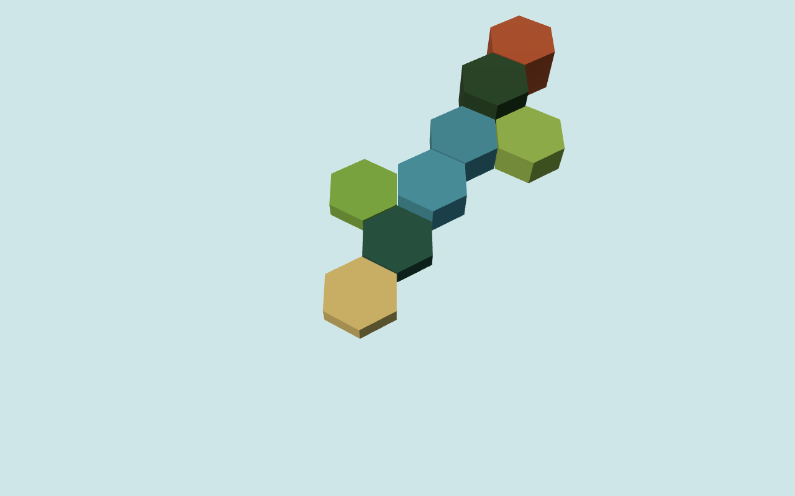
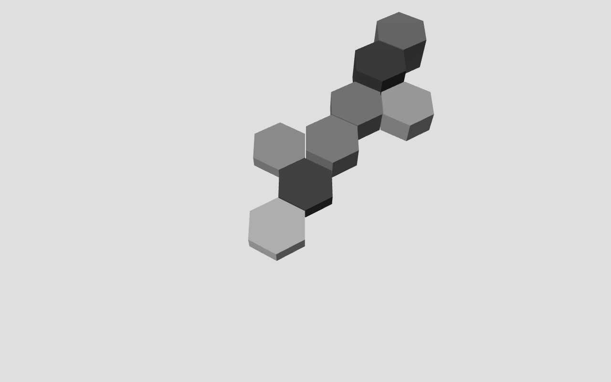

# Khazan — Build Progress

v2 build. v1 (a Leaflet sidebar-panel prototype with no 3D world) is archived at
`_archive_v1_panjim_digital_twin/`, not deleted, per the v2 brief's Section 0.

## Phase 0 — Scaffold + visual proof of life — DONE

**What's here:**
- Fresh Vite + TypeScript + Three.js repo, folder structure per Section 8.
- `src/core/hex.ts` — axial hex math (neighbors, distance, edge-adjacency, axial<->world).
  10/10 unit tests passing (`tests/hex.test.ts`): neighbor generation, distance,
  edge-adjacency and its inverse (`oppositeEdge`).
- `src/core/edgeTypes.ts` — the 6 edge-socket types (WATER/SAND/GRASS/FARM/ROCK/FOREST)
  and a compatibility matrix, ready for Phase 1's placement legality checks.
- `src/data/terrain.json` — all 7 terrain types from Section 4 with elevation tier,
  edge types, and a palette key.
- `src/render/` — palette, hex prism geometry, one `InstancedMesh` per terrain
  category (not per-hex meshes), Dorfromantik-style camera (58° elevation,
  pan/zoom only) + one directional sun + hemisphere fill + fog.
- `src/main.ts` — hand-placed proof cluster: estuary at the river mouth, coast
  and khazan flatland beside it, a 2-tile river reaching inland, then plains,
  forest, and laterite plateau — following Section 4's coast-to-highland
  gradient, all built via `neighbor()` so adjacency is real, not eyeballed.

**Verification approach:** the interactive Browser-pane tool in this session was
unreliable (screenshots timing out, tabs resolving to stale proxy ports). Rather
than depend on a human keeping a panel focused for every check, built
`tools/smoke.ts` — a headless Playwright script (`npm run smoke [label]`) that
boots the dev server, loads the page, asserts zero console errors, and saves a
PNG to `tools/screenshots/`. This is the repeatable, non-interactive path
Section 10 already asks for, so it's now the default way to verify renders,
not a fallback.

**Two real bugs the first screenshot caught:**
1. **Hex tessellation mismatch.** `hexGeometry.ts` rotated the hex prism 30°
   under the assumption that gave a "Dorfromantik-style" tile, but
   `axialToWorld`'s spacing formula assumes a pointy-top silhouette (vertex on
   ±Z), which is what `THREE.CylinderGeometry`'s default 6-segment cross-section
   already produces unrotated. The 30° rotation silently flipped the geometry to
   flat-top while the spacing math stayed pointy-top — a mismatch that would
   show up as gaps/overlaps once the map grew past a simple chain. Removed the
   rotation; geometry and math now agree.
2. **Palette failed its own grayscale QA.** Desaturating the first render
   (`0.3R+0.59G+0.11B` luma) showed laterite red and river blue landing only ~4
   luma points apart — indistinguishable once color is removed, despite very
   different hues. Recomputed all 7 terrain colors for an even ~20-26 point luma
   spread (forest 62 → mangrove 88 → laterite 115 → river 137 → paddy 162 →
   plains 182 → sand 208), rechecked with a desaturated re-render. See
   `src/render/palette.ts` for the luma annotations.

**Screenshot (`npm run smoke`, 1280x800, headless Chromium):**

**Grayscale check:**

DoD: screenshot matches Section 6 direction (grayscale-readable, laterite red
present, no UI panel) — done. `npm test` — 10/10 passing. `npm run dev` boots
clean, zero console errors — done.

## Decisions logged (Section 11 escape hatches)

- **River continuity, simplified for the pilot:** rather than full per-edge
  rotation/socket matching for a curvy single-hex-wide river (Dorfromantik's
  actual system), river/estuary are both WATER-family tiles with uniform
  edges; continuity will be enforced at placement time in Phase 1 by requiring
  a new water tile to touch the existing water network. Revisit if playtesting
  shows the map's rivers read as blobs rather than channels.
- **No tile rotation in Phase 0/1 data model.** All 7 terrain types use a
  uniform 6-edge pattern (same type on all sides) rather than mixed-edge
  variants requiring rotation search. Keeps the WFC-lite placement check in
  Phase 1 simple; can add mixed-edge variants later if the frontier feels too
  permissive.

## Next: Phase 1 — Dorfromantik placement loop

Hand-of-2-3 draw with placeability filtering, click-to-place in the 3D
frontier, edge-matching (incl. water continuity), tile-settle animation,
corner-only HUD.
